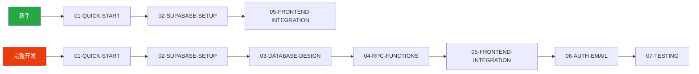

# SRM 文档中心

> 供应商关系管理系统 (Supplier Relationship Management) 完整技术文档

## 📚 文档导航

### 🚀 AI 后端开发指南

面向 AI Coding Agent 的 Supabase + React 全栈开发模式文档。

| 文档 | 描述 | 阅读时间 |
|------|------|----------|
| [00-INDEX](./ai-backend-development-guide/00-INDEX.md) | 📖 **导航索引** - 快速找到你需要的内容 | 2 min |
| [01-QUICK-START](./ai-backend-development-guide/01-QUICK-START.md) | ⚡ 5分钟快速上手，最小可运行示例 | 5 min |
| [02-SUPABASE-SETUP](./ai-backend-development-guide/02-SUPABASE-SETUP.md) | 🔧 Supabase 项目创建、MCP 配置、环境变量 | 10 min |
| [03-DATABASE-DESIGN](./ai-backend-development-guide/03-DATABASE-DESIGN.md) | 🗄️ 数据建模原则、表设计、RLS 策略 | 15 min |
| [04-RPC-FUNCTIONS](./ai-backend-development-guide/04-RPC-FUNCTIONS.md) | ⚙️ RPC 函数开发、常见模式、性能优化 | 15 min |
| [05-FRONTEND-INTEGRATION](./ai-backend-development-guide/05-FRONTEND-INTEGRATION.md) | 🎨 服务层、React Query Hooks、类型安全 | 15 min |
| [06-AUTH-EMAIL](./ai-backend-development-guide/06-AUTH-EMAIL.md) | 🔐 用户认证、Resend + Cloudflare 邮件配置 | 15 min |
| [07-TESTING](./ai-backend-development-guide/07-TESTING.md) | 🧪 分层测试策略、SQL/API/前端测试 | 10 min |
| [08-TROUBLESHOOTING](./ai-backend-development-guide/08-TROUBLESHOOTING.md) | 🔧 常见问题、错误排查、解决方案 | 参考 |
| [09-PROJECT-HANDOVER](./ai-backend-development-guide/09-PROJECT-HANDOVER.md) | 🔄 项目转移、前端 SDK 配置、交接清单 | 10 min |

### 📋 开发参考

| 文档 | 描述 |
|------|------|
| [data-mapping.md](./data-mapping.md) | 数据映射规范 |
| [frontend-backend-integration.md](./frontend-backend-integration.md) | 前后端集成指南 |
| [service-template.md](./service-template.md) | 服务层模板 |
| [implementation-progress.md](./implementation-progress.md) | 实现进度追踪 |

## 🗺️ 学习路径

## 🔗 外部资源

- [Supabase 官方文档](https://supabase.com/docs)
- [React Query 文档](https://tanstack.com/query/latest)
- [Resend 文档](https://resend.com/docs)
- [Cloudflare DNS 文档](https://developers.cloudflare.com/dns/)
