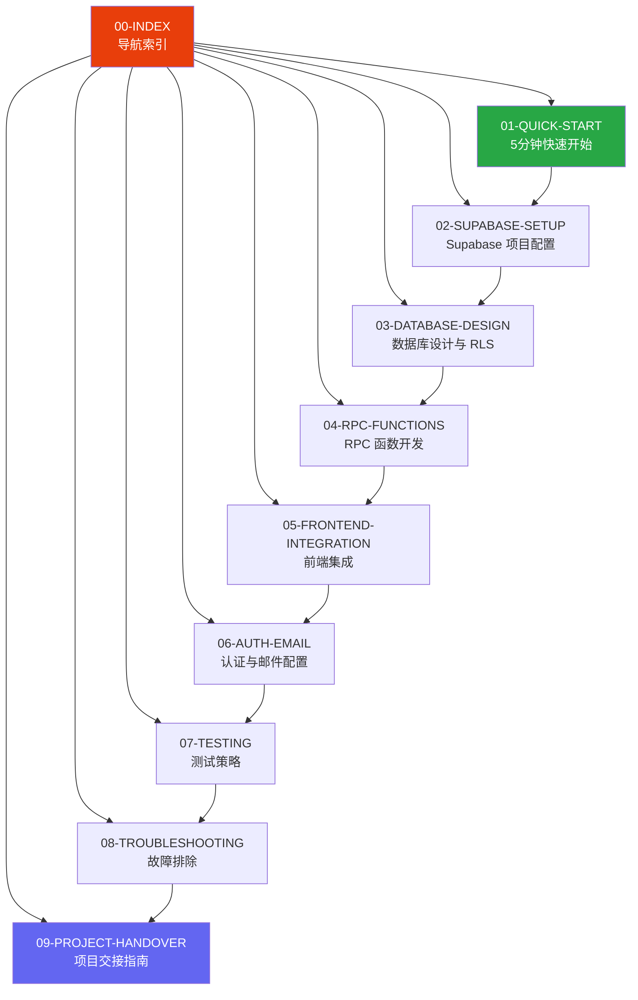

# Supabase + Coding Agent 后端开发指南

> 模块化文档索引 - 快速导航到您需要的内容

## 文档架构



## 文档列表

| 文档 | 描述 | 阅读时间 |
|------|------|----------|
| [01-QUICK-START](./01-QUICK-START.md) | 5分钟快速上手，最小可运行示例 | 5 min |
| [02-SUPABASE-SETUP](./02-SUPABASE-SETUP.md) | Supabase 项目创建、MCP 配置、环境变量 | 10 min |
| [03-DATABASE-DESIGN](./03-DATABASE-DESIGN.md) | 数据建模原则、表设计、RLS 策略 | 15 min |
| [04-RPC-FUNCTIONS](./04-RPC-FUNCTIONS.md) | RPC 函数开发、常见模式、性能优化 | 15 min |
| [05-FRONTEND-INTEGRATION](./05-FRONTEND-INTEGRATION.md) | 服务层、React Query Hooks、类型安全 | 15 min |
| [06-AUTH-EMAIL](./06-AUTH-EMAIL.md) | 用户认证、邮件服务 (Resend + Cloudflare)、DNS 配置 | 15 min |
| [07-TESTING](./07-TESTING.md) | 分层测试策略、SQL/API/前端测试 | 10 min |
| [08-TROUBLESHOOTING](./08-TROUBLESHOOTING.md) | 常见问题、错误排查、解决方案 | 参考 |
| [09-PROJECT-HANDOVER](./09-PROJECT-HANDOVER.md) | 🆕 项目转移、前端 SDK 配置、交接清单 | 10 min |

## 学习路径

### 新手路径
```
01-QUICK-START → 02-SUPABASE-SETUP → 05-FRONTEND-INTEGRATION
```

### 完整开发路径
```
01-QUICK-START → 02-SUPABASE-SETUP → 03-DATABASE-DESIGN →
04-RPC-FUNCTIONS → 05-FRONTEND-INTEGRATION → 07-TESTING
```

### 特定问题路径
- 认证问题: `06-AUTH-EMAIL`
- DNS/邮件问题: `06-AUTH-EMAIL` (Cloudflare 部分)
- 权限问题: `03-DATABASE-DESIGN` (RLS 部分)
- 性能问题: `04-RPC-FUNCTIONS` (优化部分)
- 报错排查: `08-TROUBLESHOOTING`
- 项目交接/SDK配置: `09-PROJECT-HANDOVER`

## 快速参考

### 核心命令

```bash
# 安装 SDK
npm install @supabase/supabase-js @tanstack/react-query

# 生成类型
npx supabase gen types typescript --project-id xxx > src/types/database.ts

# 运行测试
npm run test
```

### 关键配置

| 配置项 | 位置 |
|--------|------|
| 环境变量 | `.env.local` |
| Supabase 客户端 | `src/lib/supabase.ts` |
| MCP 配置 | Claude Code 设置 |
| RLS 策略 | Supabase SQL Editor |
| DNS 配置 | Cloudflare Dashboard |

---

> **相关资源**
> - [原始完整文档](./README.md)
> - [Supabase 官方文档](https://supabase.com/docs)
> - [React Query 文档](https://tanstack.com/query/latest)
> - [Resend 文档](https://resend.com/docs)
> - [Cloudflare DNS 文档](https://developers.cloudflare.com/dns/)
