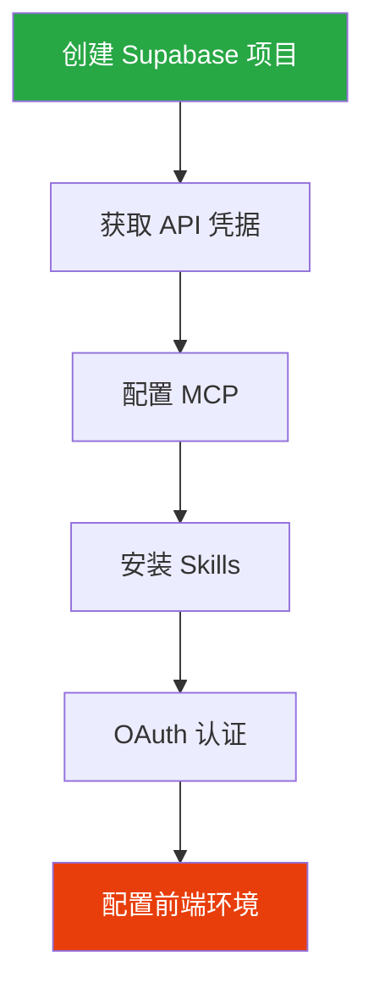
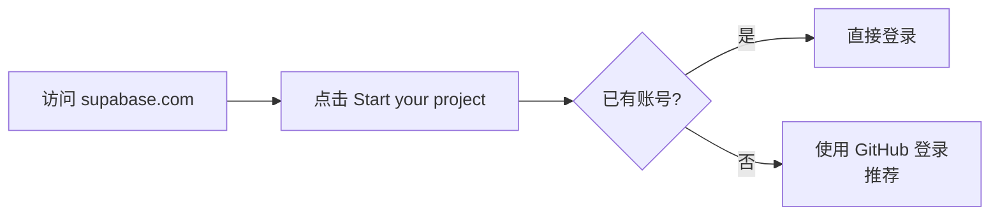
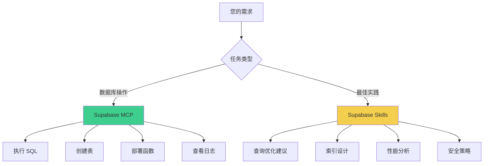

# Supabase 项目配置

> 项目创建、MCP 配置、Skills 安装、环境变量完整指南

## 配置流程



## 1. 创建 Supabase 项目

### 1.1 注册/登录



### 1.2 创建新项目

```
1. 点击 New Project
2. 选择组织（Organization）
3. 填写项目信息：
   - 项目名称：my-awesome-project
   - 数据库密码：[设置强密码并保存]
   - 区域：选择距离您最近的区域
4. 点击 Create new project
5. 等待项目创建完成（约 2 分钟）
```

### 1.3 获取关键信息

| 信息 | 获取位置 | 说明 |
|------|----------|------|
| **Project Reference** | Settings → General → Project ID | 配置 MCP 需要 |
| **Project URL** | Settings → API → Configuration | 前端连接需要 |
| **Publishable Key** | Settings → API → Project API keys | 前端连接需要（新格式） |
| Database Password | 创建时设置 | 直连数据库需要 |

```bash
# 示例
Project Reference: tdrbuwshyebmjqljggww
Project URL: https://tdrbuwshyebmjqljggww.supabase.co
Publishable Key: sb_publishable_xxxxxxxxxxxxx
```

> **注意**：新版本 Supabase 使用 `sb_publishable_xxxxx` 格式的密钥（推荐），但旧的 JWT 格式 `eyJhbGciOiJIUzI1NiIs...` 仍然可用。

---

## 2. 配置 Supabase MCP

### 2.1 找到配置文件

**Claude Code 的配置文件是 `.claude.json`**

| 操作系统 | 配置文件路径 |
|---------|------------|
| **Windows** | `C:\Users\YourName\.claude.json` |
| **macOS** | `~/.claude.json` |
| **Linux** | `~/.claude.json` |

### 2.2 添加 MCP 配置

在 `.claude.json` 文件的 **`mcpServers` 部分**添加：

```json
{
  "mcpServers": {
    "supabase": {
      "type": "http",
      "url": "https://mcp.supabase.com/mcp?project_ref=YOUR_PROJECT_REF"
    }
  }
}
```

**完整示例**：

```json
{
  "mcpServers": {
    "supabase": {
      "type": "http",
      "url": "https://mcp.supabase.com/mcp?project_ref=tdrbuwshyebmjqljggww"
    },
    "context7": {
      "type": "stdio",
      "command": "cmd",
      "args": ["/c", "npx", "-y", "@upstash/context7-mcp@latest"]
    }
  },
  "hasCompletedOnboarding": true
}
```

### 2.3 可选参数

```json
{
  "mcpServers": {
    "supabase": {
      "type": "http",
      "url": "https://mcp.supabase.com/mcp?project_ref=YOUR_PROJECT_REF&read_only=false&features=database,debugging,development,docs,functions"
    }
  }
}
```

| 参数 | 说明 | 默认值 |
|------|------|--------|
| `project_ref` | 限定特定项目 | 空（可访问所有项目） |
| `read_only` | 只读模式 | `false` |
| `features` | 启用功能组 | 全部启用 |

**功能组选项**：
- `database` - 数据库管理
- `debugging` - 日志和性能
- `development` - 开发工具
- `docs` - 文档搜索
- `functions` - Edge Functions
- `branching` - 分支管理（实验性）

### 2.4 OAuth 认证


---

## 3. 安装 Supabase Skills

### 3.1 什么是 Skills

**Skills = 静态知识库**，提供 PostgreSQL 最佳实践和优化建议。

**包含内容**：
- 查询性能优化规则
- 索引设计建议
- 模式设计指南
- RLS 安全策略
- 连接池配置
- 并发控制

### 3.2 Skills vs MCP 对比

| 特性 | Skills | MCP |
|------|--------|-----|
| **性质** | 静态知识库 | 动态执行器 |
| **功能** | 提供建议 | 执行操作 |
| **认证** | 不需要 | OAuth |
| **更新** | 手动 | 自动 |
| **适用** | 云端+私有化 | 主要云端 |

### 3.3 安装方式

**方式一：手动克隆（推荐）**

```bash
# 1. 克隆仓库到 Skills 目录
# Windows
git clone https://github.com/supabase/agent-skills.git "%USERPROFILE%\.claude\skills\supabase-agent-skills"

# macOS/Linux
git clone https://github.com/supabase/agent-skills.git ~/.claude/skills/supabase-agent-skills

# 2. 复制 skill 到正确位置
# Windows
xcopy "%USERPROFILE%\.claude\skills\supabase-agent-skills\skills\supabase-postgres-best-practices" "%USERPROFILE%\.claude\skills\supabase-postgres-best-practices" /E /I /Y

# macOS/Linux
cp -r ~/.claude/skills/supabase-agent-skills/skills/supabase-postgres-best-practices ~/.claude/skills/
```

**方式二：一键命令**

```bash
# Windows (PowerShell)
git clone https://github.com/supabase/agent-skills.git $env:USERPROFILE\.claude\skills\supabase-agent-skills ; Copy-Item -Path "$env:USERPROFILE\.claude\skills\supabase-agent-skills\skills\supabase-postgres-best-practices" -Destination "$env:USERPROFILE\.claude\skills\supabase-postgres-best-practices" -Recurse

# macOS/Linux
git clone https://github.com/supabase/agent-skills.git ~/.claude/skills/supabase-agent-skills && cp -r ~/.claude/skills/supabase-agent-skills/skills/supabase-postgres-best-practices ~/.claude/skills/
```

### 3.4 验证安装

```bash
# Windows
dir "%USERPROFILE%\.claude\skills\supabase-postgres-best-practices"

# macOS/Linux
ls ~/.claude/skills/supabase-postgres-best-practices
```

应该看到：
```
supabase-postgres-best-practices/
├── SKILL.md
├── AGENTS.md
├── README.md
└── references/
    ├── query-*.md
    ├── schema-*.md
    └── security-*.md
```

### 3.5 更新 Skills

```bash
# 进入 Skills 目录
cd ~/.claude/skills/supabase-agent-skills

# 拉取最新版本
git pull origin main
```

---

## 4. 前端项目配置

### 4.1 环境变量

创建 `.env.local`：

```env
# Supabase 配置（从 Dashboard → Settings → API 获取）
VITE_SUPABASE_URL=https://your-project-id.supabase.co
VITE_SUPABASE_PUBLISHABLE_KEY=sb_publishable_xxxxxxxxxxxxx
```

> **兼容性说明**：
> - 新格式：`sb_publishable_xxxxx`（推荐）
> - 旧格式：`eyJhbGciOiJIUzI1NiIs...`（仍然可用）
> - 环境变量名可保持 `VITE_SUPABASE_ANON_KEY` 以兼容旧项目

### 4.2 安装依赖

```bash
# 核心依赖
npm install @supabase/supabase-js

# React Query 集成 (推荐)
npm install @tanstack/react-query
```

### 4.3 初始化客户端

```typescript
// src/lib/supabase.ts
import { createClient } from '@supabase/supabase-js'
import type { Database } from '../types/database'

const supabaseUrl = import.meta.env.VITE_SUPABASE_URL
const supabaseKey = import.meta.env.VITE_SUPABASE_PUBLISHABLE_KEY

if (!supabaseUrl || !supabaseKey) {
  throw new Error(
    '缺少 Supabase 配置！\n' +
    '请确保 .env.local 文件存在并包含：\n' +
    '  VITE_SUPABASE_URL=xxx\n' +
    '  VITE_SUPABASE_PUBLISHABLE_KEY=xxx'
  )
}

export const supabase = createClient<Database>(supabaseUrl, supabaseKey, {
  auth: {
    persistSession: true,      // 持久化会话
    autoRefreshToken: true,    // 自动刷新 Token
    detectSessionInUrl: true,  // 检测 URL 中的会话
    flowType: 'pkce',          // 使用 PKCE 流程（更安全）
  },
})
```

### 4.4 React Query Provider

```typescript
// src/lib/queryClient.tsx
import { QueryClient, QueryClientProvider } from '@tanstack/react-query'
import { ReactNode } from 'react'

const queryClient = new QueryClient({
  defaultOptions: {
    queries: {
      staleTime: 1000 * 60 * 5, // 5 分钟
      retry: 1,
    },
  },
})

export function QueryProvider({ children }: { children: ReactNode }) {
  return (
    <QueryClientProvider client={queryClient}>
      {children}
    </QueryClientProvider>
  )
}
```

---

## 5. MCP + Skills 协同工作



### 5.1 常用 MCP 工具

| 工具 | 用途 |
|------|------|
| `list_tables` | 列出所有数据表 |
| `list_extensions` | 列出已安装扩展 |
| `list_migrations` | 列出迁移记录 |
| `apply_migration` | 应用 SQL 迁移 |
| `execute_sql` | 执行 SQL 语句 |
| `get_logs` | 获取日志 |
| `get_advisors` | 获取性能建议 |
| `generate_typescript_types` | 生成类型定义 |

### 5.2 Skills 提供的规则

```
Query Performance（查询性能）
├── 索引优化
├── 查询重写
└── 执行计划分析

Schema Design（模式设计）
├── 数据类型选择
├── 外键设计
└── 表结构优化

Security（安全）
├── RLS 策略
└── 权限管理
```

---

## 6. Supabase CLI (可选)

```bash
# 安装 CLI
npm install -g supabase

# 登录
supabase login

# 关联项目
supabase link --project-ref your-project-id

# 生成类型定义
npx supabase gen types typescript --project-id your-project-id > src/types/database.ts
```

---

## 注意事项

### 安全性

```typescript
// ❌ 禁止：硬编码凭据
const key = "sb_publishable_xxxxx"

// ✅ 正确：使用环境变量
const key = import.meta.env.VITE_SUPABASE_PUBLISHABLE_KEY
```

### .gitignore

确保添加：

```gitignore
.env.local
.env.*.local
```

---

## 常见问题

### Q: MCP 连接失败？

1. 检查 `.claude.json` 中的 `mcpServers` 配置
2. 重新进行 OAuth 认证
3. 确认网络可访问 Supabase

### Q: 环境变量读取失败？

1. 确认文件名为 `.env.local`
2. 确认变量名以 `VITE_` 开头 (Vite 项目)
3. 重启开发服务器

### Q: Publishable Key 和 Anon Key 有什么区别？

两者功能相同，都是前端公开使用的密钥：
- **新格式** (`sb_publishable_xxxxx`) - Supabase 新版本推荐
- **旧格式** (JWT 格式) - 仍然完全兼容

### Q: Skills 安装后不生效？

1. 确认安装路径正确
2. 重启 Claude Code
3. 检查 SKILL.md 文件是否存在

---

> **下一步**: [03-DATABASE-DESIGN](./03-DATABASE-DESIGN.md) - 学习数据库设计与 RLS 策略
