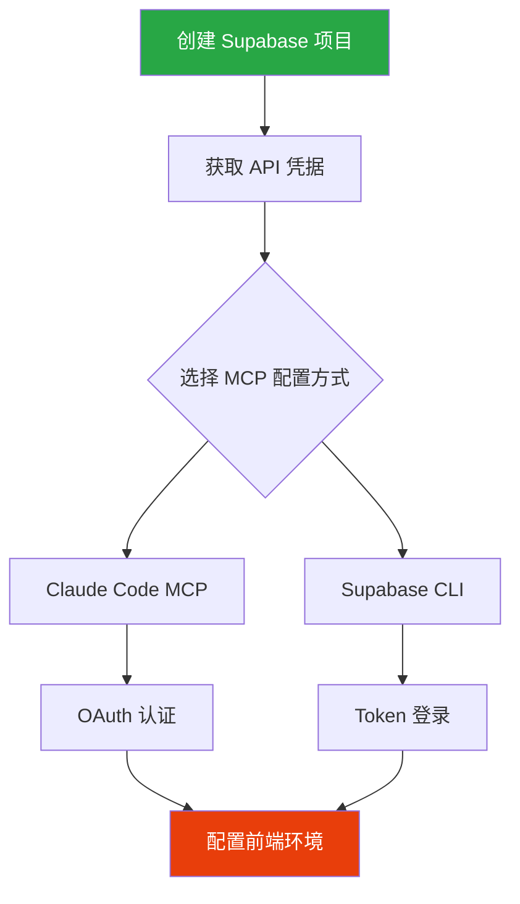

# Supabase 项目配置

> 项目创建、MCP 配置、环境变量完整指南

## 配置流程



## 1. 创建 Supabase 项目

### 1.1 项目创建

1. 访问 [Supabase Dashboard](https://supabase.com/dashboard)
2. 创建新组织（如需要）
3. 点击 "New Project"

### 1.2 记录关键信息

| 信息 | 获取位置 |
|------|----------|
| Project ID | Dashboard URL 或 Settings > General |
| Project URL | `https://{project-id}.supabase.co` |
| Anon Key | Settings > API > Project API keys |
| Database Password | 创建时设置 |

```bash
# 示例
Project URL: https://abcdefgh.supabase.co
Anon Key: eyJhbGciOiJIUzI1NiIsInR5cCI6IkpXVCJ9.eyJpc3MiOiJzdXBhYmFzZ...
```

## 2. MCP 配置

### 2.1 Claude Code MCP (推荐)

在 Claude Code 配置文件中添加:

```json
{
  "mcpServers": {
    "supabase": {
      "command": "npx",
      "args": ["-y", "@supabase/mcp-server-supabase"],
      "env": {
        "SUPABASE_PROJECT_ID": "your-project-id"
      }
    }
  }
}
```

### 2.2 认证方式

最新版 MCP 使用 OAuth 认证:

1. 在 Claude Code 中输入 `/mcp`
2. 选择 Supabase
3. 选择 auth 验证
4. 浏览器自动跳转，完成登录
5. 登录成功后即可使用 MCP 工具

### 2.3 Supabase CLI (可选)

```bash
# 安装 CLI
npm install -g supabase

# 登录
supabase login

# 关联项目
supabase link --project-ref your-project-id

# 生成类型定义
npx supabase gen types typescript --project-id your-project-id > src/types/database.ts
```

## 3. 前端项目配置

### 3.1 环境变量

创建 `.env.local`:

```env
# Supabase 配置
VITE_SUPABASE_URL=https://your-project-id.supabase.co
VITE_SUPABASE_ANON_KEY=eyJhbGciOiJIUzI1NiIsInR5cCI6IkpXVCJ9...
```

> **重要**: 让 Coding Agent 使用 MCP 工具获取这些值，而非手动输入。

### 3.2 安装依赖

```bash
# 核心依赖
npm install @supabase/supabase-js

# React Query 集成 (推荐)
npm install @tanstack/react-query
```

### 3.3 初始化客户端

```typescript
// src/lib/supabase.ts
import { createClient } from '@supabase/supabase-js'

const supabaseUrl = import.meta.env.VITE_SUPABASE_URL
const supabaseAnonKey = import.meta.env.VITE_SUPABASE_ANON_KEY

if (!supabaseUrl || !supabaseAnonKey) {
  throw new Error('Missing Supabase environment variables')
}

export const supabase = createClient(supabaseUrl, supabaseAnonKey, {
  auth: {
    persistSession: true,
    autoRefreshToken: true,
  },
})
```

### 3.4 React Query Provider

```typescript
// src/lib/queryClient.tsx
import { QueryClient, QueryClientProvider } from '@tanstack/react-query'
import { ReactNode } from 'react'

const queryClient = new QueryClient({
  defaultOptions: {
    queries: {
      staleTime: 1000 * 60 * 5, // 5 分钟
      retry: 1,
    },
  },
})

export function QueryProvider({ children }: { children: ReactNode }) {
  return (
    <QueryClientProvider client={queryClient}>
      {children}
    </QueryClientProvider>
  )
}
```

## 4. 常用 MCP 工具

| 工具 | 用途 |
|------|------|
| `list_tables` | 列出所有数据表 |
| `list_extensions` | 列出已安装扩展 |
| `list_migrations` | 列出迁移记录 |
| `apply_migration` | 应用 SQL 迁移 |
| `execute_sql` | 执行 SQL 语句 |
| `get_logs` | 获取日志 |
| `generate_typescript_types` | 生成类型定义 |

## 注意事项

### 安全性

```typescript
// ❌ 禁止：硬编码凭据
const key = "eyJhbGciOiJIUzI1NiIs..."

// ✅ 正确：使用环境变量
const key = import.meta.env.VITE_SUPABASE_ANON_KEY
```

### .gitignore

确保添加:

```gitignore
.env.local
.env.*.local
```

## 常见问题

### Q: MCP 连接失败？

1. 检查 Project ID 是否正确
2. 重新进行 OAuth 认证
3. 确认网络可访问 Supabase

### Q: 环境变量读取失败？

1. 确认文件名为 `.env.local`
2. 确认变量名以 `VITE_` 开头 (Vite 项目)
3. 重启开发服务器

---

> **下一步**: [03-DATABASE-DESIGN](./03-DATABASE-DESIGN.md) - 学习数据库设计与 RLS 策略
