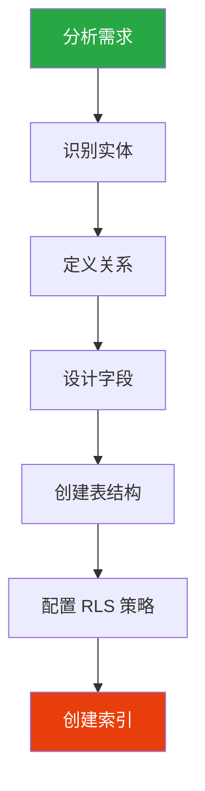
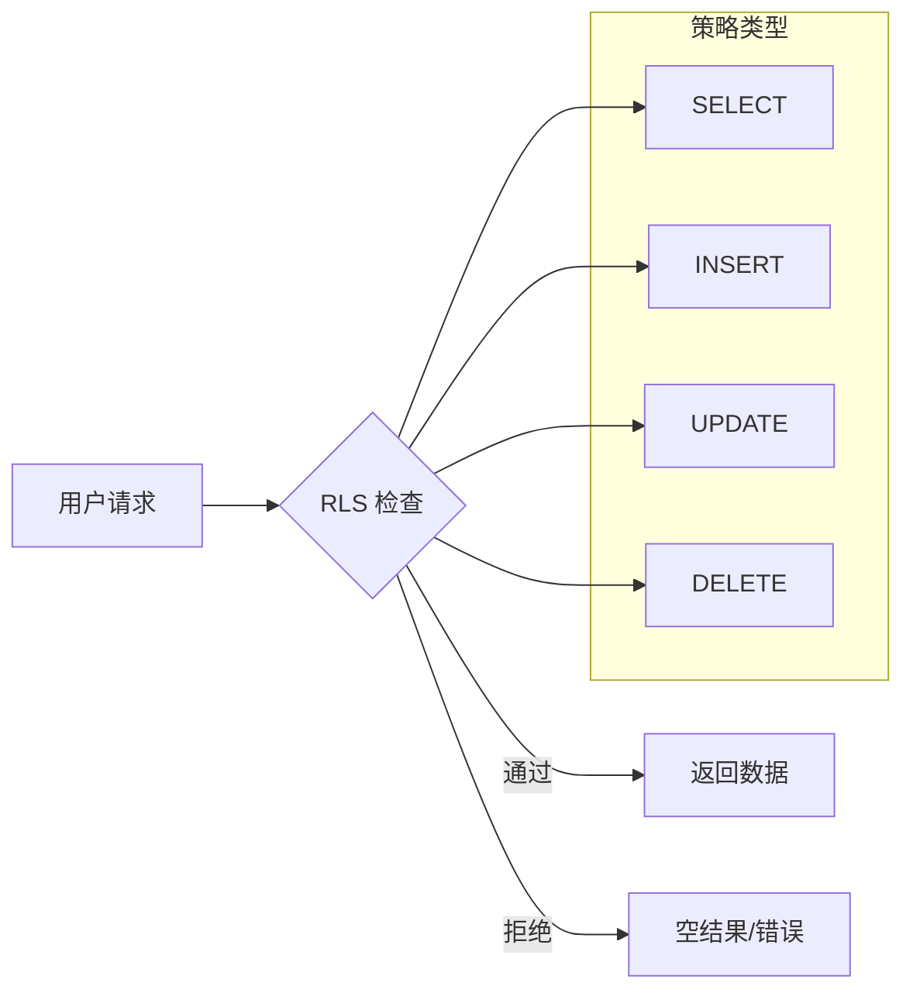
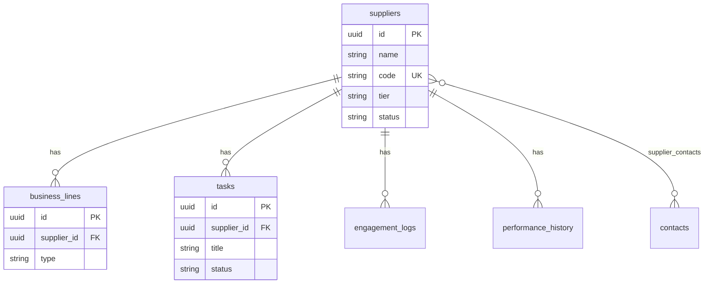

# 数据库设计与 RLS

> 数据建模原则、表设计模板、行级安全策略

## 数据库设计流程



## 1. 设计原则

### 1.1 核心原则

| 原则 | 说明 |
|------|------|
| 主键 | 使用 UUID，`gen_random_uuid()` 自动生成 |
| 时间戳 | `created_at`, `updated_at` 自动更新 |
| 软删除 | 使用 `deleted_at` 而非物理删除 |
| 审计 | `created_by`, `updated_by` 记录操作人 |
| 命名 | 表名复数，snake_case |

### 1.2 字段类型选择

```sql
-- 常用类型
UUID          -- 主键、外键
VARCHAR(n)    -- 短文本
TEXT          -- 长文本
INTEGER       -- 整数
DECIMAL       -- 精确小数
BOOLEAN       -- 布尔值
TIMESTAMPTZ   -- 带时区时间戳
JSONB         -- JSON 数据
```

## 2. 表结构模板

### 2.1 基础表模板

```sql
-- 通用更新时间触发器
CREATE OR REPLACE FUNCTION update_updated_at_column()
RETURNS TRIGGER AS $$
BEGIN
  NEW.updated_at = NOW();
  RETURN NEW;
END;
$$ LANGUAGE plpgsql;

-- 示例：供应商表
CREATE TABLE suppliers (
  -- 主键
  id UUID PRIMARY KEY DEFAULT gen_random_uuid(),

  -- 基础字段
  name VARCHAR(255) NOT NULL,
  code VARCHAR(50) UNIQUE NOT NULL,
  tier VARCHAR(50) DEFAULT 'backup',
  status VARCHAR(50) DEFAULT 'active',
  description TEXT,

  -- 审计字段
  created_at TIMESTAMPTZ DEFAULT NOW(),
  updated_at TIMESTAMPTZ DEFAULT NOW(),
  created_by UUID REFERENCES auth.users(id),
  updated_by UUID REFERENCES auth.users(id),
  deleted_at TIMESTAMPTZ,

  -- 约束
  CONSTRAINT valid_tier CHECK (tier IN ('strategic', 'core', 'backup', 'probation', 'blacklisted'))
);

-- 自动更新时间戳
CREATE TRIGGER update_suppliers_updated_at
  BEFORE UPDATE ON suppliers
  FOR EACH ROW
  EXECUTE FUNCTION update_updated_at_column();

-- 启用 RLS
ALTER TABLE suppliers ENABLE ROW LEVEL SECURITY;
```

### 2.2 关联表模板

```sql
-- 一对多关系：供应商 -> 业务线
CREATE TABLE business_lines (
  id UUID PRIMARY KEY DEFAULT gen_random_uuid(),
  supplier_id UUID NOT NULL REFERENCES suppliers(id) ON DELETE CASCADE,
  type VARCHAR(100) NOT NULL,
  description TEXT,
  created_at TIMESTAMPTZ DEFAULT NOW(),

  -- 唯一约束
  CONSTRAINT unique_supplier_type UNIQUE (supplier_id, type)
);

-- 多对多关系：供应商 <-> 联系人
CREATE TABLE supplier_contacts (
  id UUID PRIMARY KEY DEFAULT gen_random_uuid(),
  supplier_id UUID NOT NULL REFERENCES suppliers(id) ON DELETE CASCADE,
  contact_id UUID NOT NULL REFERENCES contacts(id) ON DELETE CASCADE,
  role VARCHAR(100),
  is_primary BOOLEAN DEFAULT false,
  created_at TIMESTAMPTZ DEFAULT NOW(),

  CONSTRAINT unique_supplier_contact UNIQUE (supplier_id, contact_id)
);
```

## 3. RLS 策略配置

### 3.1 RLS 架构



### 3.2 策略模式

```sql
-- 模式 1: 用户只能访问自己的数据
CREATE POLICY "Users can view own data"
  ON suppliers FOR SELECT
  USING (auth.uid() = created_by);

CREATE POLICY "Users can insert own data"
  ON suppliers FOR INSERT
  WITH CHECK (auth.uid() = created_by);

CREATE POLICY "Users can update own data"
  ON suppliers FOR UPDATE
  USING (auth.uid() = created_by);

-- 模式 2: 基于角色
CREATE POLICY "Admins can do anything"
  ON suppliers FOR ALL
  USING (
    EXISTS (
      SELECT 1 FROM user_roles
      WHERE user_id = auth.uid()
      AND role = 'admin'
    )
  );

-- 模式 3: 公开读取，登录写入
CREATE POLICY "Public read"
  ON suppliers FOR SELECT
  USING (true);

CREATE POLICY "Authenticated write"
  ON suppliers FOR ALL
  USING (auth.role() = 'authenticated');
```

### 3.3 RLS 最佳实践

```sql
-- ❌ 避免：过于宽松
CREATE POLICY "Allow all" ON suppliers FOR ALL USING (true);

-- ✅ 推荐：最小权限原则
CREATE POLICY "Users own data" ON suppliers
  FOR ALL USING (auth.uid() = created_by);

-- ✅ 推荐：组合条件
CREATE POLICY "Active users own active records"
  ON suppliers FOR SELECT
  USING (
    auth.uid() = created_by
    AND deleted_at IS NULL
    AND status = 'active'
  );
```

## 4. 索引优化

```sql
-- 单列索引
CREATE INDEX idx_suppliers_status ON suppliers(status);
CREATE INDEX idx_suppliers_created_at ON suppliers(created_at DESC);

-- 组合索引
CREATE INDEX idx_suppliers_tier_status ON suppliers(tier, status);

-- 全文搜索索引
CREATE INDEX idx_suppliers_name_search ON suppliers USING gin(to_tsvector('english', name));

-- JSONB 索引
CREATE INDEX idx_suppliers_meta_gin ON suppliers USING gin(metadata);
```

## 5. 实体关系示例



## 注意事项

### 性能考虑

1. 避免过度索引 - 影响写入性能
2. 使用 `EXPLAIN ANALYZE` 分析查询
3. 大表考虑分区

### 安全考虑

1. 所有表启用 RLS
2. 避免 `USING (true)` 策略
3. 敏感数据考虑加密

---

> **下一步**: [04-RPC-FUNCTIONS](./04-RPC-FUNCTIONS.md) - 学习 RPC 函数开发
