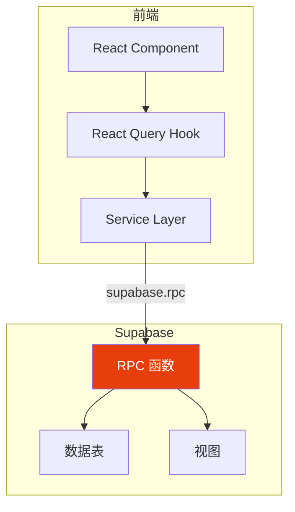

# RPC 函数开发

> PostgreSQL 函数开发、常见模式、性能优化

## RPC 函数架构



## 1. 函数设计原则

### 1.1 安全配置

```sql
-- ✅ 推荐模式
CREATE OR REPLACE FUNCTION my_function()
RETURNS TABLE (...)
SECURITY DEFINER SET search_path = public
AS $$
BEGIN
  -- 函数体
END;
$$ LANGUAGE plpgsql;
```

| 属性 | 说明 |
|------|------|
| `SECURITY DEFINER` | 以函数定义者权限执行 |
| `SET search_path = public` | 避免表名冲突 |
| `LANGUAGE plpgsql` | 使用 PL/pgSQL 语言 |

### 1.2 命名约定

| 前缀 | 用途 |
|------|------|
| `get_` | 查询单条/列表 |
| `create_` | 创建记录 |
| `update_` | 更新记录 |
| `delete_` | 删除记录 |
| `xxx_stats` | 统计聚合 |

## 2. 常见函数模式

### 2.1 查询函数

```sql
-- 获取单条记录
CREATE OR REPLACE FUNCTION get_supplier_by_id(p_id UUID)
RETURNS TABLE (
  id UUID,
  name VARCHAR,
  tier VARCHAR,
  status VARCHAR
)
SECURITY DEFINER SET search_path = public
AS $$
BEGIN
  RETURN QUERY
  SELECT s.id, s.name, s.tier, s.status
  FROM public.suppliers s
  WHERE s.id = p_id AND s.deleted_at IS NULL;
END;
$$ LANGUAGE plpgsql;

-- 获取列表（带分页）
CREATE OR REPLACE FUNCTION get_suppliers_paginated(
  p_limit INT DEFAULT 20,
  p_offset INT DEFAULT 0,
  p_status VARCHAR DEFAULT NULL
)
RETURNS TABLE (
  id UUID,
  name VARCHAR,
  tier VARCHAR,
  total_count BIGINT
)
SECURITY DEFINER SET search_path = public
AS $$
BEGIN
  RETURN QUERY
  SELECT
    s.id,
    s.name,
    s.tier,
    COUNT(*) OVER() AS total_count
  FROM public.suppliers s
  WHERE s.deleted_at IS NULL
    AND (p_status IS NULL OR s.status = p_status)
  ORDER BY s.created_at DESC
  LIMIT p_limit
  OFFSET p_offset;
END;
$$ LANGUAGE plpgsql;
```

### 2.2 统计函数

```sql
-- 仪表盘统计
CREATE OR REPLACE FUNCTION get_dashboard_stats()
RETURNS JSON
SECURITY DEFINER SET search_path = public
AS $$
DECLARE
  result JSON;
BEGIN
  SELECT json_build_object(
    'total_suppliers', (SELECT COUNT(*) FROM public.suppliers WHERE deleted_at IS NULL),
    'active_suppliers', (SELECT COUNT(*) FROM public.suppliers WHERE status = 'active' AND deleted_at IS NULL),
    'pending_tasks', (SELECT COUNT(*) FROM public.tasks WHERE status = 'pending'),
    'recent_logs', (
      SELECT json_agg(json_build_object(
        'id', id,
        'type', type,
        'created_at', created_at
      ))
      FROM public.engagement_logs
      ORDER BY created_at DESC
      LIMIT 5
    )
  ) INTO result;

  RETURN result;
END;
$$ LANGUAGE plpgsql;
```

### 2.3 创建/更新函数

```sql
-- 创建记录
CREATE OR REPLACE FUNCTION create_supplier(
  p_name VARCHAR,
  p_code VARCHAR,
  p_tier VARCHAR DEFAULT 'backup',
  p_user_id UUID
)
RETURNS UUID
SECURITY DEFINER SET search_path = public
AS $$
DECLARE
  v_id UUID;
BEGIN
  INSERT INTO public.suppliers (name, code, tier, created_by)
  VALUES (p_name, p_code, p_tier, p_user_id)
  RETURNING id INTO v_id;

  RETURN v_id;
END;
$$ LANGUAGE plpgsql;

-- 批量更新
CREATE OR REPLACE FUNCTION update_suppliers_tier(
  p_supplier_ids UUID[],
  p_new_tier VARCHAR
)
RETURNS INT
SECURITY DEFINER SET search_path = public
AS $$
DECLARE
  v_count INT;
BEGIN
  UPDATE public.suppliers
  SET tier = p_new_tier, updated_at = NOW()
  WHERE id = ANY(p_supplier_ids)
    AND deleted_at IS NULL;

  GET DIAGNOSTICS v_count = ROW_COUNT;
  RETURN v_count;
END;
$$ LANGUAGE plpgsql;
```

### 2.4 复杂查询（JOIN）

```sql
-- 获取供应商完整信息（含关联数据）
CREATE OR REPLACE FUNCTION get_supplier_detail(p_id UUID)
RETURNS JSON
SECURITY DEFINER SET search_path = public
AS $$
DECLARE
  result JSON;
BEGIN
  SELECT json_build_object(
    'supplier', row_to_json(s.*),
    'business_lines', (
      SELECT json_agg(json_build_object(
        'id', bl.id,
        'type', bl.type,
        'description', bl.description
      ))
      FROM public.business_lines bl
      WHERE bl.supplier_id = p_id
    ),
    'contacts', (
      SELECT json_agg(json_build_object(
        'id', c.id,
        'name', c.name,
        'role', sc.role
      ))
      FROM public.supplier_contacts sc
      JOIN public.contacts c ON c.id = sc.contact_id
      WHERE sc.supplier_id = p_id
    ),
    'tasks', (
      SELECT json_agg(json_build_object(
        'id', t.id,
        'title', t.title,
        'status', t.status
      ))
      FROM public.tasks t
      WHERE t.supplier_id = p_id
      ORDER BY t.created_at DESC
      LIMIT 10
    )
  ) INTO result
  FROM public.suppliers s
  WHERE s.id = p_id AND s.deleted_at IS NULL;

  RETURN result;
END;
$$ LANGUAGE plpgsql;
```

## 3. 性能优化

### 3.1 查询优化

```sql
-- 使用 EXPLAIN ANALYZE 分析
EXPLAIN ANALYZE SELECT * FROM get_suppliers_paginated(20, 0);

-- 优化建议
-- 1. 添加适当的索引
-- 2. 使用 LIMIT 限制返回行数
-- 3. 避免在循环中执行查询
-- 4. 使用 JOIN 替代子查询
```

### 3.2 函数优化技巧

```sql
-- ❌ 避免：N+1 查询
FOR rec IN SELECT id FROM suppliers LOOP
  SELECT COUNT(*) INTO v_count FROM tasks WHERE supplier_id = rec.id;
END LOOP;

-- ✅ 推荐：批量查询
SELECT s.id, COUNT(t.id) as task_count
FROM suppliers s
LEFT JOIN tasks t ON t.supplier_id = s.id
GROUP BY s.id;
```

## 4. 前端调用

```typescript
// 调用 RPC 函数
const { data, error } = await supabase.rpc('get_supplier_detail', {
  p_id: supplierId
})

// 带参数调用
const { data, error } = await supabase.rpc('get_suppliers_paginated', {
  p_limit: 20,
  p_offset: 0,
  p_status: 'active'
})
```

## 常见问题

### Q: "relation does not exist" 错误？

```sql
-- 原因：search_path 问题
-- 解决：添加 SECURITY DEFINER SET search_path = public
ALTER FUNCTION my_function SET search_path = public;
```

### Q: 函数返回 null？

1. 检查参数是否正确传递
2. 检查 RLS 策略是否允许访问
3. 检查 WHERE 条件是否过滤掉了数据

### Q: 如何调试函数？

```sql
-- 使用 RAISE NOTICE 输出调试信息
RAISE NOTICE '参数值: %', p_id;
RAISE NOTICE '查询结果: %', result;
```

---

> **下一步**: [05-FRONTEND-INTEGRATION](./05-FRONTEND-INTEGRATION.md) - 前端集成与服务层设计
