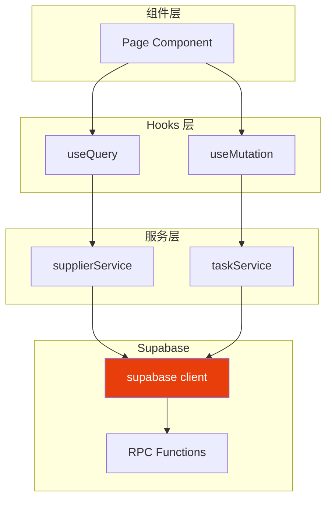

# 前端集成

> 服务层设计、React Query Hooks、类型安全

## 前端集成架构



## 1. 服务层设计

### 1.1 服务层模板

```typescript
// src/services/baseService.ts
import { supabase } from '../lib/supabase'

export interface BaseEntity {
  id: string
  created_at: string
  updated_at?: string
  deleted_at?: string | null
}

// 通用 CRUD 操作
export function createService<T extends BaseEntity>(tableName: string) {
  return {
    async getAll(): Promise<T[]> {
      const { data, error } = await supabase
        .from(tableName)
        .select('*')
        .is('deleted_at', null)
        .order('created_at', { ascending: false })

      if (error) throw error
      return data || []
    },

    async getById(id: string): Promise<T | null> {
      const { data, error } = await supabase
        .from(tableName)
        .select('*')
        .eq('id', id)
        .is('deleted_at', null)
        .single()

      if (error) throw error
      return data
    },

    async create(input: Partial<T>): Promise<T> {
      const { data, error } = await supabase
        .from(tableName)
        .insert(input)
        .select()
        .single()

      if (error) throw error
      return data
    },

    async update(id: string, input: Partial<T>): Promise<T> {
      const { data, error } = await supabase
        .from(tableName)
        .update(input)
        .eq('id', id)
        .select()
        .single()

      if (error) throw error
      return data
    },

    async delete(id: string): Promise<void> {
      const { error } = await supabase
        .from(tableName)
        .update({ deleted_at: new Date().toISOString() })
        .eq('id', id)

      if (error) throw error
    }
  }
}
```

### 1.2 具体服务实现

```typescript
// src/services/supplierService.ts
import { supabase } from '../lib/supabase'

// 类型定义
export interface Supplier {
  id: string
  name: string
  code: string
  tier: 'strategic' | 'core' | 'backup' | 'probation' | 'blacklisted'
  status: 'active' | 'inactive' | 'blacklisted'
  created_at: string
  updated_at: string
  deleted_at: string | null
}

export interface SupplierStats {
  total: number
  active: number
  by_tier: Record<string, number>
}

// 查询列表
export async function getSuppliers(): Promise<Supplier[]> {
  const { data, error } = await supabase
    .from('suppliers')
    .select('*')
    .is('deleted_at', null)
    .order('created_at', { ascending: false })

  if (error) throw error
  return data || []
}

// 查询详情（使用 RPC）
export async function getSupplierDetail(id: string): Promise<Supplier | null> {
  const { data, error } = await supabase.rpc('get_supplier_detail', {
    p_id: id
  })

  if (error) throw error
  return data
}

// 获取统计
export async function getSupplierStats(): Promise<SupplierStats> {
  const { data, error } = await supabase.rpc('get_supplier_stats')

  if (error) throw error
  return data
}

// 创建
export async function createSupplier(
  input: Pick<Supplier, 'name' | 'code'> & Partial<Supplier>
): Promise<Supplier> {
  const { data, error } = await supabase
    .from('suppliers')
    .insert(input)
    .select()
    .single()

  if (error) throw error
  return data
}

// 更新
export async function updateSupplier(
  id: string,
  input: Partial<Supplier>
): Promise<Supplier> {
  const { data, error } = await supabase
    .from('suppliers')
    .update({
      ...input,
      updated_at: new Date().toISOString()
    })
    .eq('id', id)
    .select()
    .single()

  if (error) throw error
  return data
}

// 软删除
export async function deleteSupplier(id: string): Promise<void> {
  const { error } = await supabase
    .from('suppliers')
    .update({ deleted_at: new Date().toISOString() })
    .eq('id', id)

  if (error) throw error
}
```

## 2. React Query Hooks

### 2.1 查询 Hooks

```typescript
// src/hooks/useSuppliers.ts
import { useQuery, useMutation, useQueryClient } from '@tanstack/react-query'
import {
  getSuppliers,
  getSupplierDetail,
  getSupplierStats,
  createSupplier,
  updateSupplier,
  deleteSupplier
} from '../services/supplierService'

// 获取列表
export function useSuppliers() {
  return useQuery({
    queryKey: ['suppliers'],
    queryFn: getSuppliers,
    staleTime: 1000 * 60 * 5, // 5 分钟
  })
}

// 获取详情
export function useSupplierDetail(id: string | undefined) {
  return useQuery({
    queryKey: ['suppliers', id],
    queryFn: () => getSupplierDetail(id!),
    enabled: !!id, // 只有 id 存在时才执行
  })
}

// 获取统计
export function useSupplierStats() {
  return useQuery({
    queryKey: ['suppliers', 'stats'],
    queryFn: getSupplierStats,
  })
}
```

### 2.2 变更 Hooks

```typescript
// 创建
export function useCreateSupplier() {
  const queryClient = useQueryClient()

  return useMutation({
    mutationFn: createSupplier,
    onSuccess: () => {
      // 刷新列表
      queryClient.invalidateQueries({ queryKey: ['suppliers'] })
      // 刷新统计
      queryClient.invalidateQueries({ queryKey: ['suppliers', 'stats'] })
    },
  })
}

// 更新
export function useUpdateSupplier() {
  const queryClient = useQueryClient()

  return useMutation({
    mutationFn: ({ id, input }: { id: string; input: Partial<Supplier> }) =>
      updateSupplier(id, input),
    onSuccess: (_, variables) => {
      // 刷新列表
      queryClient.invalidateQueries({ queryKey: ['suppliers'] })
      // 刷新详情
      queryClient.invalidateQueries({ queryKey: ['suppliers', variables.id] })
    },
  })
}

// 删除
export function useDeleteSupplier() {
  const queryClient = useQueryClient()

  return useMutation({
    mutationFn: deleteSupplier,
    onSuccess: () => {
      queryClient.invalidateQueries({ queryKey: ['suppliers'] })
      queryClient.invalidateQueries({ queryKey: ['suppliers', 'stats'] })
    },
  })
}
```

### 2.3 Hooks 规则

```typescript
// ❌ 错误：在条件语句中调用 Hook
if (supplierId) {
  const { data } = useSupplierDetail(supplierId)
}

// ✅ 正确：使用 enabled 选项
const { data } = useSupplierDetail(supplierId) // 在组件顶层调用

// 在 render 中根据条件使用
if (!supplierId) return <div>请选择供应商</div>
```

**重要**: 所有 Hooks 必须在组件顶层、所有条件判断之前调用！

## 3. 组件使用示例

```tsx
// src/pages/SupplierList.tsx
import { useSuppliers, useSupplierStats, useDeleteSupplier } from '../hooks/useSuppliers'

export function SupplierList() {
  const { data: suppliers, isLoading, error } = useSuppliers()
  const { data: stats } = useSupplierStats()
  const deleteMutation = useDeleteSupplier()

  if (isLoading) return <div>加载中...</div>
  if (error) return <div>错误: {error.message}</div>

  const handleDelete = async (id: string) => {
    if (confirm('确定删除？')) {
      await deleteMutation.mutateAsync(id)
    }
  }

  return (
    <div>
      <h1>供应商管理</h1>
      <p>总计: {stats?.total} | 活跃: {stats?.active}</p>

      <ul>
        {suppliers?.map(supplier => (
          <li key={supplier.id}>
            {supplier.name} ({supplier.tier})
            <button onClick={() => handleDelete(supplier.id)}>
              删除
            </button>
          </li>
        ))}
      </ul>
    </div>
  )
}
```

## 4. 类型安全

### 4.1 生成类型定义

```bash
# 从 Supabase 生成类型
npx supabase gen types typescript --project-id your-project-id > src/types/database.ts
```

### 4.2 使用生成的类型

```typescript
// src/types/database.ts (自动生成)
export interface Database {
  public: {
    Tables: {
      suppliers: {
        Row: {
          id: string
          name: string
          code: string
          tier: string
          // ...
        }
        Insert: {
          id?: string
          name: string
          code: string
          tier?: string
          // ...
        }
        Update: {
          id?: string
          name?: string
          // ...
        }
      }
    }
  }
}

// 使用类型
import { Database } from '../types/database'

type Supplier = Database['public']['Tables']['suppliers']['Row']
type SupplierInsert = Database['public']['Tables']['suppliers']['Insert']
```

## 注意事项

### 错误处理

```typescript
// 统一错误处理
try {
  await createMutation.mutateAsync(input)
} catch (error) {
  if (error instanceof Error) {
    toast.error(error.message)
  }
}
```

### 加载状态

```typescript
// 使用 mutation 状态
const createMutation = useCreateSupplier()

<button
  onClick={() => createMutation.mutate(input)}
  disabled={createMutation.isPending}
>
  {createMutation.isPending ? '提交中...' : '提交'}
</button>
```

---

> **下一步**: [06-AUTH-EMAIL](./06-AUTH-EMAIL.md) - 认证与邮件配置
