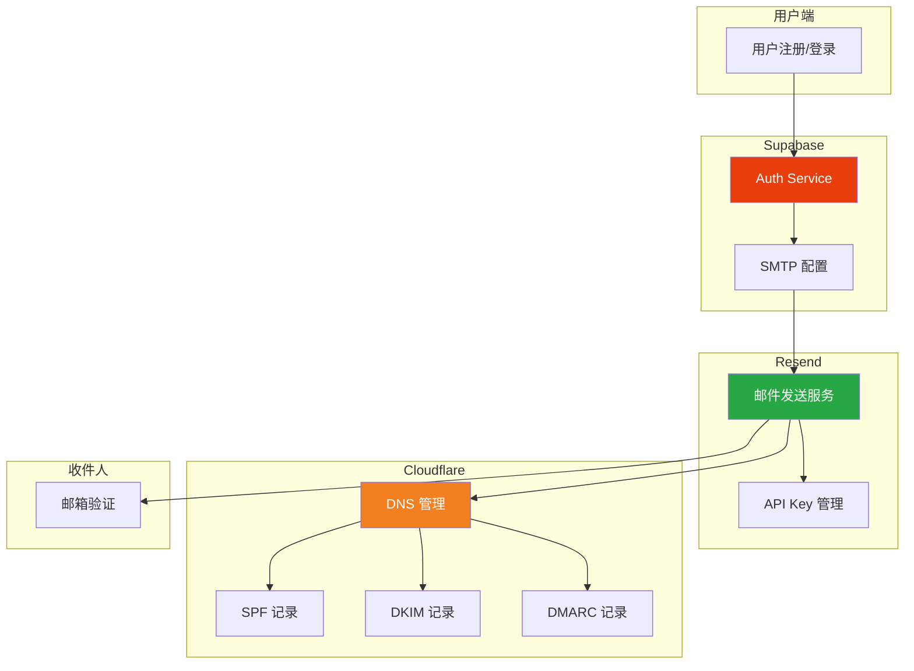
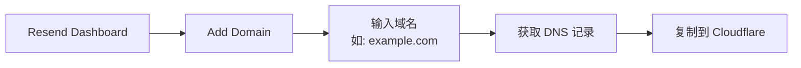
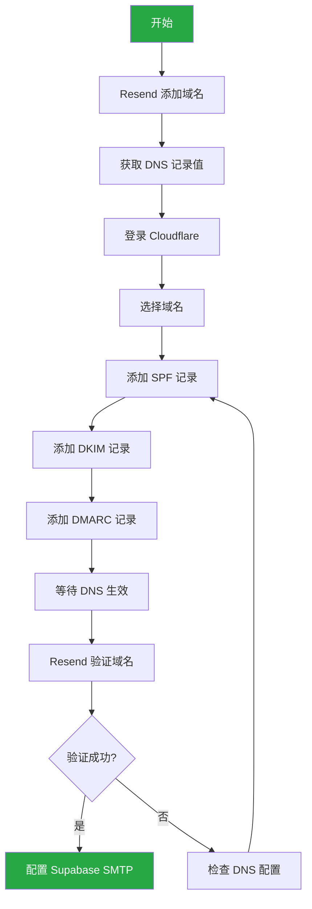
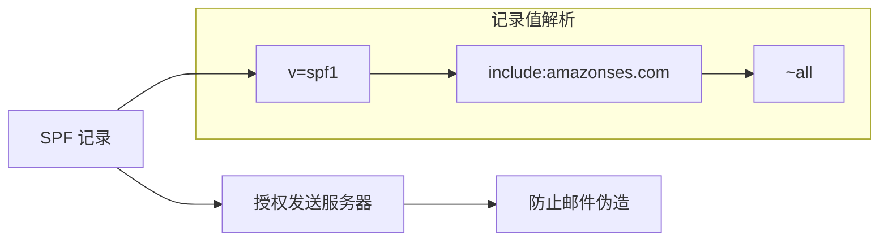
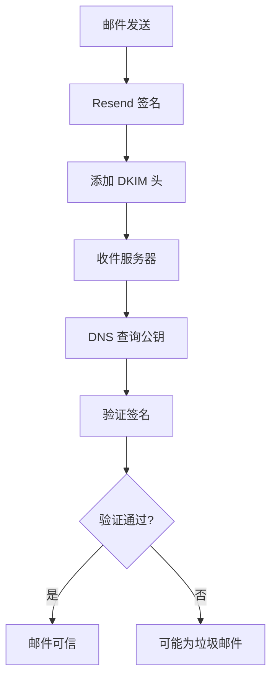
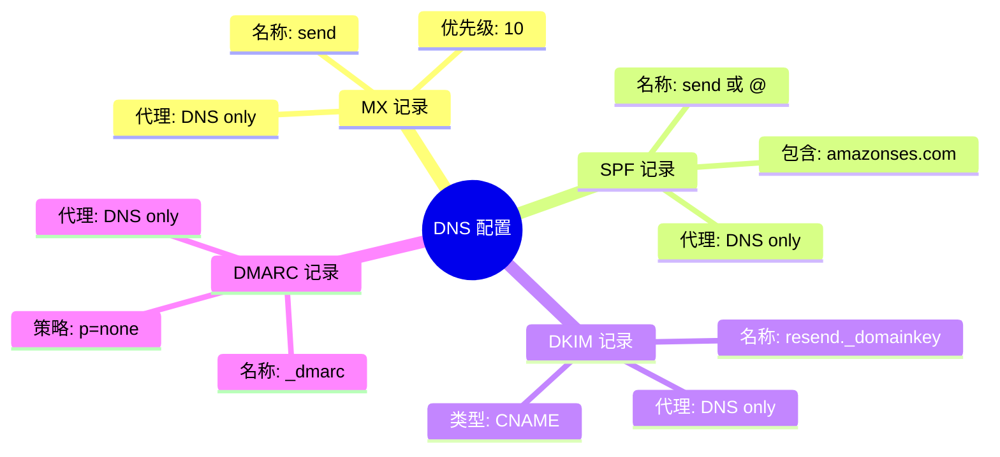
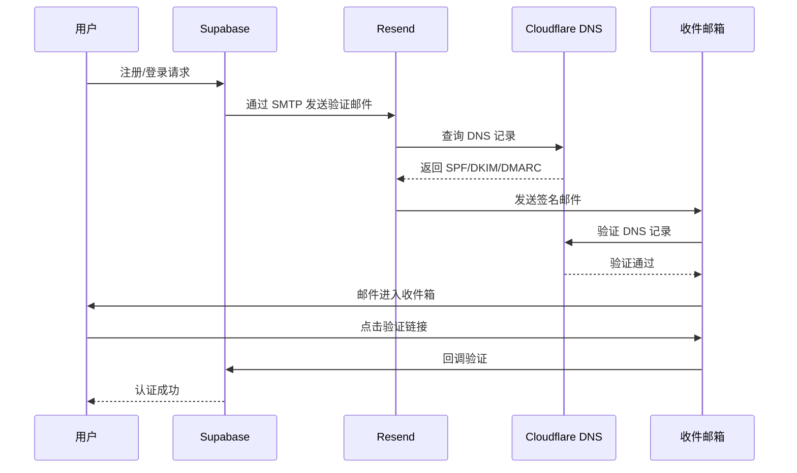

# 认证与邮件配置

> 用户认证、邮件服务 (Resend + Cloudflare)、垃圾邮件避免

## 三方联动架构



**核心流程说明**：
1. **Supabase Auth** 处理用户认证请求
2. **Resend** 作为邮件发送网关
3. **Cloudflare** 提供 DNS 托管和域名验证
4. 三者协同确保邮件送达率和安全性

## 1. Supabase Auth 配置

### 1.1 启用认证

1. Dashboard → Authentication → Providers
2. 启用 "Email" 认证
3. 配置选项:

| 选项 | 说明 |
|------|------|
| Enable email confirmations | 需要邮箱验证 |
| Secure email change | 安全更改邮箱 |
| Secure password change | 安全更改密码 |

### 1.2 邮件模板配置

Dashboard → Authentication → Email Templates

```html
<!-- 确认邮件模板 -->
<h2>欢迎注册</h2>
<p>请点击以下链接完成注册：</p>
<a href="{{ .ConfirmationURL }}">确认邮箱</a>
<p>链接有效期为 24 小时。</p>
```

### 1.3 前端认证代码

```typescript
// src/contexts/AuthContext.tsx
import { createContext, useContext, useEffect, useState, ReactNode } from 'react'
import { User, Session } from '@supabase/supabase-js'
import { supabase } from '../lib/supabase'

interface AuthContextType {
  user: User | null
  session: Session | null
  loading: boolean
  signIn: (email: string, password: string) => Promise<void>
  signUp: (email: string, password: string) => Promise<void>
  signOut: () => Promise<void>
}

const AuthContext = createContext<AuthContextType | undefined>(undefined)

export function AuthProvider({ children }: { children: ReactNode }) {
  const [user, setUser] = useState<User | null>(null)
  const [session, setSession] = useState<Session | null>(null)
  const [loading, setLoading] = useState(true)

  useEffect(() => {
    // 获取当前 session
    supabase.auth.getSession().then(({ data: { session } }) => {
      setSession(session)
      setUser(session?.user ?? null)
      setLoading(false)
    })

    // 监听认证状态变化
    const { data: { subscription } } = supabase.auth.onAuthStateChange(
      (_event, session) => {
        setSession(session)
        setUser(session?.user ?? null)
      }
    )

    return () => subscription.unsubscribe()
  }, [])

  const signIn = async (email: string, password: string) => {
    const { error } = await supabase.auth.signInWithPassword({ email, password })
    if (error) throw error
  }

  const signUp = async (email: string, password: string) => {
    const { error } = await supabase.auth.signUp({ email, password })
    if (error) throw error
  }

  const signOut = async () => {
    const { error } = await supabase.auth.signOut()
    if (error) throw error
  }

  return (
    <AuthContext.Provider value={{ user, session, loading, signIn, signUp, signOut }}>
      {children}
    </AuthContext.Provider>
  )
}

export function useAuth() {
  const context = useContext(AuthContext)
  if (!context) throw new Error('useAuth must be used within AuthProvider')
  return context
}
```

## 2. Resend 邮件服务配置

### 2.1 注册 Resend

1. 访问 [Resend](https://resend.com)
2. 注册账号（可使用 GitHub 登录）
3. 进入 Dashboard → Domains → Add Domain

### 2.2 添加域名



## 3. Cloudflare DNS 配置 (核心)

### 3.1 配置流程图



### 3.2 详细配置步骤

#### 步骤 1: 在 Resend 获取 DNS 记录

1. 登录 [Resend Dashboard](https://resend.com/domains)
2. 点击已添加的域名
3. 查看 "DNS Records" 区域，获取以下记录值

#### 步骤 2: 在 Cloudflare 配置 DNS

登录 [Cloudflare Dashboard](https://dash.cloudflare.com) → 选择域名 → DNS → Records

**必须配置的记录：**

| 记录类型 | 名称 | 内容 | 代理状态 | TTL |
|---------|------|------|---------|-----|
| **MX** | `send` | `feedback-smtp.us-east-1.amazonses.com` | DNS only | Auto |
| **TXT** | `send` | `v=spf1 include:amazonses.com ~all` | DNS only | Auto |
| **CNAME** | `resend._domainkey` | `resend._domainkey.resend.com` | DNS only | Auto |
| **TXT** | `_dmarc` | `v=DMARC1; p=none; rua=mailto:dmarc@your-domain.com` | DNS only | Auto |

> **注意**：所有邮件相关记录的代理状态必须设为 **DNS only**（灰色云朵）

#### 步骤 3: SPF 记录详解



**Cloudflare 配置示例：**

```
类型: TXT
名称: send (或 @ 表示根域名)
内容: v=spf1 include:amazonses.com ~all
代理状态: DNS only (灰色云朵)
```

#### 步骤 4: DKIM 记录详解

DKIM 提供邮件数字签名验证：



**Cloudflare 配置示例：**

```
类型: CNAME
名称: resend._domainkey
目标: resend._domainkey.resend.com
代理状态: DNS only (灰色云朵)
```

#### 步骤 5: DMARC 记录详解

DMARC 告诉收件服务器如何处理未通过验证的邮件：

```
类型: TXT
名称: _dmarc
内容: v=DMARC1; p=none; rua=mailto:dmarc@your-domain.com
代理状态: DNS only (灰色云朵)
```

**DMARC 策略选项：**

| 策略 | 说明 | 推荐场景 |
|------|------|---------|
| `p=none` | 仅监控，不做处理 | 初始配置阶段 |
| `p=quarantine` | 标记为可疑 | 过渡阶段 |
| `p=reject` | 直接拒绝 | 生产环境 |

### 3.3 Cloudflare 配置检查清单



### 3.4 验证 DNS 配置

使用命令行工具验证：

```bash
# 验证 SPF 记录
dig TXT send.your-domain.com +short

# 验证 DKIM 记录
dig CNAME resend._domainkey.your-domain.com +short

# 验证 DMARC 记录
dig TXT _dmarc.your-domain.com +short
```

或使用在线工具：
- [MXToolbox](https://mxtoolbox.com/SuperTool.aspx)
- [DMARC Analyzer](https://www.dmarcanalyzer.com/)

## 4. Supabase SMTP 集成

### 4.1 配置 SMTP

Dashboard → Authentication → SMTP Settings

```
Host: smtp.resend.com
Port: 587
User: resend
Password: re_xxxxx (你的 Resend API Key)
Sender Email: noreply@your-domain.com
Sender Name: Your App Name
```

### 4.2 获取 Resend API Key

1. 登录 [Resend Dashboard](https://resend.com/api-keys)
2. 点击 "Create API Key"
3. 选择权限范围（推荐 "Sending access"）
4. 复制生成的 API Key（以 `re_` 开头）

### 4.3 完整配置流程图



## 5. 避免垃圾邮件

### 5.1 检查清单

| 措施 | 必须 | 说明 |
|------|:----:|------|
| 域名验证 | ✅ | 完成 Resend 域名验证 |
| SPF 记录 | ✅ | 防止邮件伪造 |
| DKIM 记录 | ✅ | 邮件签名验证 |
| DMARC 记录 | ⚠️ | 建议配置 |
| 发件人地址 | ✅ | 使用验证过的域名邮箱 |
| Cloudflare 代理 | ❌ | 邮件记录必须 DNS only |

### 5.2 邮件内容建议

```html
<!-- ✅ 推荐 -->
<h2>欢迎注册</h2>
<p>请点击以下链接完成注册：</p>
<a href="{{ .ConfirmationURL }}">确认邮箱</a>

<!-- ❌ 避免 -->
<!-- 使用大量感叹号、紧急词汇、大写字母 -->
<h2>紧急！！！立即验证您的账户！！！</h2>
```

### 5.3 发送频率控制

- 避免短时间内发送大量邮件
- 使用队列控制发送速率
- 监控退信率和投诉率

## 6. 路由保护

```typescript
// src/components/ProtectedRoute.tsx
import { Navigate } from 'react-router-dom'
import { useAuth } from '../contexts/AuthContext'

export function ProtectedRoute({ children }: { children: React.ReactNode }) {
  const { user, loading } = useAuth()

  if (loading) {
    return <div>加载中...</div>
  }

  if (!user) {
    return <Navigate to="/login" replace />
  }

  return <>{children}</>
}
```

```typescript
// App.tsx
import { BrowserRouter, Routes, Route } from 'react-router-dom'
import { AuthProvider } from './contexts/AuthContext'
import { ProtectedRoute } from './components/ProtectedRoute'
import Login from './pages/Login'
import Dashboard from './pages/Dashboard'

function App() {
  return (
    <AuthProvider>
      <BrowserRouter>
        <Routes>
          <Route path="/login" element={<Login />} />
          <Route
            path="/"
            element={
              <ProtectedRoute>
                <Dashboard />
              </ProtectedRoute>
            }
          />
        </Routes>
      </BrowserRouter>
    </AuthProvider>
  )
}
```

## 常见问题

### Q: 邮件发送失败？

1. 检查 Cloudflare DNS 记录是否正确
2. 确认所有记录的代理状态为 "DNS only"
3. 确认 SMTP 配置无误
4. 查看 Resend Dashboard 日志
5. 检查发件人地址是否已验证

### Q: 邮件进入垃圾箱？

1. 完成 SPF/DKIM/DMARC 配置
2. 确认 Cloudflare 代理已关闭（灰色云朵）
3. 检查邮件内容是否触发垃圾邮件过滤
4. 使用 [Mail Tester](https://www.mail-tester.com/) 测试评分
5. 等待域名预热 (新域名需要时间建立信誉)

### Q: DNS 记录不生效？

1. DNS 传播需要 5-48 小时
2. 使用 `dig` 命令检查解析结果
3. 确认 Cloudflare 名称服务器已正确配置
4. 清除本地 DNS 缓存：`ipconfig /flushdns` (Windows)

### Q: Cloudflare 代理导致问题？

邮件相关 DNS 记录**必须**关闭 Cloudflare 代理：
- MX 记录：DNS only
- SPF (TXT) 记录：DNS only
- DKIM (CNAME/TXT) 记录：DNS only
- DMARC (TXT) 记录：DNS only

### Q: 认证回调失败？

1. 检查 Redirect URL 配置
2. 确认 URL 在 Supabase 白名单中
3. 检查 PKCE 流程是否正确

---

> **下一步**: [07-TESTING](./07-TESTING.md) - 测试策略
