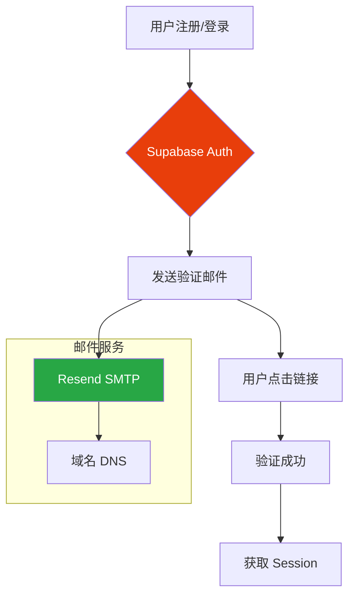

# 认证与邮件配置

> 用户认证、邮件服务 (Resend)、垃圾邮件避免

## 认证架构



## 1. Supabase Auth 配置

### 1.1 启用认证

1. Dashboard → Authentication → Providers
2. 启用 "Email" 认证
3. 配置选项:

| 选项 | 说明 |
|------|------|
| Enable email confirmations | 需要邮箱验证 |
| Secure email change | 安全更改邮箱 |
| Secure password change | 安全更改密码 |

### 1.2 邮件模板配置

Dashboard → Authentication → Email Templates

```html
<!-- 确认邮件模板 -->
<h2>欢迎注册</h2>
<p>请点击以下链接完成注册：</p>
<a href="{{ .ConfirmationURL }}">确认邮箱</a>
<p>链接有效期为 24 小时。</p>
```

### 1.3 前端认证代码

```typescript
// src/contexts/AuthContext.tsx
import { createContext, useContext, useEffect, useState, ReactNode } from 'react'
import { User, Session } from '@supabase/supabase-js'
import { supabase } from '../lib/supabase'

interface AuthContextType {
  user: User | null
  session: Session | null
  loading: boolean
  signIn: (email: string, password: string) => Promise<void>
  signUp: (email: string, password: string) => Promise<void>
  signOut: () => Promise<void>
}

const AuthContext = createContext<AuthContextType | undefined>(undefined)

export function AuthProvider({ children }: { children: ReactNode }) {
  const [user, setUser] = useState<User | null>(null)
  const [session, setSession] = useState<Session | null>(null)
  const [loading, setLoading] = useState(true)

  useEffect(() => {
    // 获取当前 session
    supabase.auth.getSession().then(({ data: { session } }) => {
      setSession(session)
      setUser(session?.user ?? null)
      setLoading(false)
    })

    // 监听认证状态变化
    const { data: { subscription } } = supabase.auth.onAuthStateChange(
      (_event, session) => {
        setSession(session)
        setUser(session?.user ?? null)
      }
    )

    return () => subscription.unsubscribe()
  }, [])

  const signIn = async (email: string, password: string) => {
    const { error } = await supabase.auth.signInWithPassword({ email, password })
    if (error) throw error
  }

  const signUp = async (email: string, password: string) => {
    const { error } = await supabase.auth.signUp({ email, password })
    if (error) throw error
  }

  const signOut = async () => {
    const { error } = await supabase.auth.signOut()
    if (error) throw error
  }

  return (
    <AuthContext.Provider value={{ user, session, loading, signIn, signUp, signOut }}>
      {children}
    </AuthContext.Provider>
  )
}

export function useAuth() {
  const context = useContext(AuthContext)
  if (!context) throw new Error('useAuth must be used within AuthProvider')
  return context
}
```

## 2. Resend 邮件服务配置

### 2.1 注册 Resend

1. 访问 [Resend](https://resend.com)
2. 注册账号
3. 添加域名并验证

### 2.2 DNS 配置

在域名 DNS 管理中添加以下记录:

| 类型 | 名称 | 值 |
|------|------|-----|
| TXT | @ | `v=spf1 include:_spf.resend.com ~all` |
| TXT | resend._domainkey | (Resend 提供的 DKIM 值) |
| TXT | _dmarc | `v=DMARC1; p=none;` |

### 2.3 Supabase SMTP 配置

Dashboard → Authentication → SMTP Settings

```
Host: smtp.resend.com
Port: 587
User: resend
Password: (Resend API Key)
Sender Email: noreply@your-domain.com
Sender Name: Your App Name
```

### 2.4 Resend SMTP 信息

```bash
# Resend SMTP 配置
Host: smtp.resend.com
Port: 587 (TLS) 或 2525
Username: resend
Password: re_xxxxx (你的 API Key)
```

## 3. 避免垃圾邮件

### 3.1 检查清单

| 措施 | 必须 | 说明 |
|------|:----:|------|
| 域名验证 | ✅ | 完成 Resend 域名验证 |
| SPF 记录 | ✅ | 防止邮件伪造 |
| DKIM 记录 | ✅ | 邮件签名验证 |
| DMARC 记录 | ⚠️ | 建议配置 |
| 发件人地址 | ✅ | 使用验证过的域名邮箱 |

### 3.2 邮件内容建议

```html
<!-- ✅ 推荐 -->
<h2>欢迎注册</h2>
<p>请点击以下链接完成注册：</p>
<a href="{{ .ConfirmationURL }}">确认邮箱</a>

<!-- ❌ 避免 -->
<!-- 使用大量感叹号、紧急词汇、大写字母 -->
<h2>紧急！！！立即验证您的账户！！！</h2>
```

### 3.3 发送频率控制

- 避免短时间内发送大量邮件
- 使用队列控制发送速率
- 监控退信率和投诉率

## 4. 路由保护

```typescript
// src/components/ProtectedRoute.tsx
import { Navigate } from 'react-router-dom'
import { useAuth } from '../contexts/AuthContext'

export function ProtectedRoute({ children }: { children: React.ReactNode }) {
  const { user, loading } = useAuth()

  if (loading) {
    return <div>加载中...</div>
  }

  if (!user) {
    return <Navigate to="/login" replace />
  }

  return <>{children}</>
}
```

```typescript
// App.tsx
import { BrowserRouter, Routes, Route } from 'react-router-dom'
import { AuthProvider } from './contexts/AuthContext'
import { ProtectedRoute } from './components/ProtectedRoute'
import Login from './pages/Login'
import Dashboard from './pages/Dashboard'

function App() {
  return (
    <AuthProvider>
      <BrowserRouter>
        <Routes>
          <Route path="/login" element={<Login />} />
          <Route
            path="/"
            element={
              <ProtectedRoute>
                <Dashboard />
              </ProtectedRoute>
            }
          />
        </Routes>
      </BrowserRouter>
    </AuthProvider>
  )
}
```

## 常见问题

### Q: 邮件发送失败？

1. 检查 DNS 记录是否正确
2. 确认 SMTP 配置无误
3. 查看 Resend Dashboard 日志
4. 检查发件人地址是否已验证

### Q: 邮件进入垃圾箱？

1. 完成 SPF/DKIM/DMARC 配置
2. 检查邮件内容是否触发垃圾邮件过滤
3. 使用 Mail Tester 测试评分
4. 等待域名预热 (新域名需要时间建立信誉)

### Q: 认证回调失败？

1. 检查 Redirect URL 配置
2. 确认 URL 在 Supabase 白名单中
3. 检查 PKCE 流程是否正确

---

> **下一步**: [07-TESTING](./07-TESTING.md) - 测试策略
