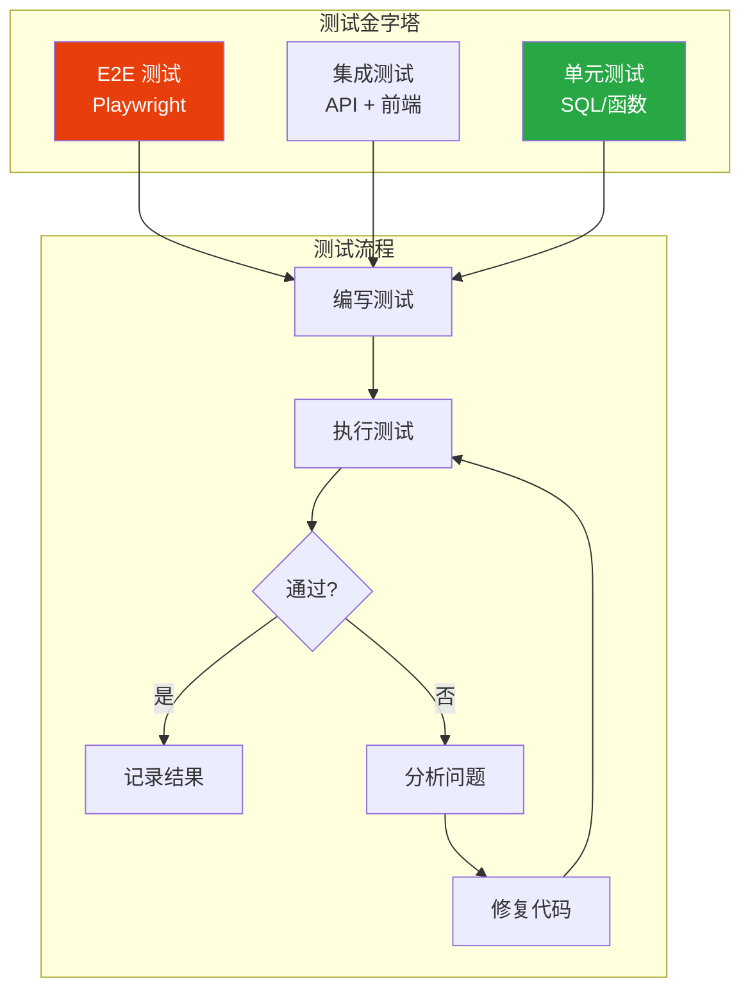
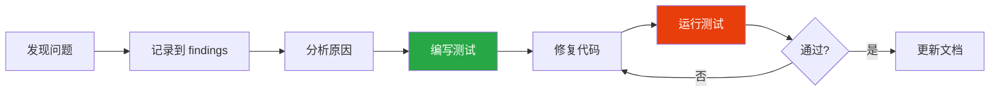

# 测试策略

> 分层测试方法、SQL/API/前端测试

## 测试架构



## 1. 分层测试策略

### 1.1 测试层次

| 层次 | 范围 | 工具 | 执行频率 |
|------|------|------|----------|
| SQL 测试 | RPC 函数、查询 | SQL Editor | 每次修改 |
| API 测试 | Supabase API | Node.js 脚本 | 每次部署 |
| 前端测试 | 组件交互 | Playwright | 每次提交 |

### 1.2 测试优先级

```
1. SQL 层测试 - 验证数据正确性
2. API 层测试 - 验证接口可用性
3. 前端测试 - 验证用户交互
```

## 2. SQL 层测试

### 2.1 测试 RPC 函数

```sql
-- 测试查询函数
SELECT * FROM get_supplier_by_id('已知-uuid');

-- 测试统计函数
SELECT * FROM get_dashboard_stats();

-- 验证返回结构
SELECT json_build_object(
  'has_total', (result->>'total_suppliers') IS NOT NULL,
  'has_active', (result->>'active_suppliers') IS NOT NULL
) FROM get_dashboard_stats() AS result;

-- 测试边界条件
SELECT * FROM get_suppliers_paginated(0, 0);  -- 空结果
SELECT * FROM get_suppliers_paginated(NULL, NULL);  -- 默认值
```

### 2.2 测试 RLS 策略

```sql
-- 模拟不同用户测试
SET LOCAL role = authenticated;
SET LOCAL request.jwt.claims = '{"sub": "user-uuid"}';

-- 验证只能看到自己的数据
SELECT * FROM suppliers;  -- 应该只返回 created_by = user-uuid 的数据

-- 重置
RESET role;
```

### 2.3 测试数据准备

```sql
-- 创建测试数据
INSERT INTO suppliers (id, name, code, tier, status)
VALUES
  ('test-uuid-1', '测试供应商A', 'TEST001', 'core', 'active'),
  ('test-uuid-2', '测试供应商B', 'TEST002', 'backup', 'active');

-- 测试完成后清理
DELETE FROM suppliers WHERE id IN ('test-uuid-1', 'test-uuid-2');
```

## 3. API 层测试

### 3.1 测试脚本模板

```javascript
// test-api.mjs
import { createClient } from '@supabase/supabase-js'
import 'dotenv/config'

const supabase = createClient(
  process.env.VITE_SUPABASE_URL,
  process.env.VITE_SUPABASE_ANON_KEY
)

// 测试结果记录
const results = {
  passed: [],
  failed: []
}

// 测试工具函数
async function test(name, fn) {
  try {
    await fn()
    results.passed.push(name)
    console.log(`✅ ${name}`)
  } catch (error) {
    results.failed.push({ name, error: error.message })
    console.error(`❌ ${name}: ${error.message}`)
  }
}

// 断言函数
function assert(condition, message) {
  if (!condition) throw new Error(message || 'Assertion failed')
}

// 测试用例
async function runTests() {
  // 测试连接
  await test('数据库连接', async () => {
    const { error } = await supabase.from('suppliers').select('id').limit(1)
    assert(!error, `连接失败: ${error?.message}`)
  })

  // 测试查询
  await test('供应商列表查询', async () => {
    const { data, error } = await supabase
      .from('suppliers')
      .select('*')
      .limit(10)

    assert(!error, `查询失败: ${error?.message}`)
    assert(Array.isArray(data), '返回应该是数组')
  })

  // 测试 RPC
  await test('统计 RPC 函数', async () => {
    const { data, error } = await supabase.rpc('get_supplier_stats')

    assert(!error, `RPC 调用失败: ${error?.message}`)
    assert(data !== null, '返回数据不应为 null')
  })

  // 测试创建
  await test('创建供应商', async () => {
    const { data, error } = await supabase
      .from('suppliers')
      .insert({
        name: `测试供应商 ${Date.now()}`,
        code: `TEST${Date.now()}`
      })
      .select()
      .single()

    assert(!error, `创建失败: ${error?.message}`)
    assert(data?.id, '应该返回 ID')

    // 清理
    if (data?.id) {
      await supabase.from('suppliers').delete().eq('id', data.id)
    }
  })

  // 输出结果
  console.log('\n--- 测试结果 ---')
  console.log(`通过: ${results.passed.length}`)
  console.log(`失败: ${results.failed.length}`)

  if (results.failed.length > 0) {
    process.exit(1)
  }
}

runTests()
```

### 3.2 运行测试

```bash
# 安装依赖
npm install @supabase/supabase-js dotenv

# 运行测试
node test-api.mjs
```

## 4. 前端集成测试

### 4.1 Playwright 测试示例

```typescript
// tests/e2e/auth.spec.ts
import { test, expect } from '@playwright/test'

test.describe('认证流程', () => {
  test('登录页面应该正常显示', async ({ page }) => {
    await page.goto('/#/login')

    await expect(page.locator('input[type="email"]')).toBeVisible()
    await expect(page.locator('input[type="password"]')).toBeVisible()
    await expect(page.locator('button[type="submit"]')).toBeVisible()
  })

  test('登录失败应该显示错误', async ({ page }) => {
    await page.goto('/#/login')

    await page.fill('input[type="email"]', 'wrong@example.com')
    await page.fill('input[type="password"]', 'wrongpassword')
    await page.click('button[type="submit"]')

    // 等待错误提示
    await expect(page.locator('.error-message, [role="alert"]')).toBeVisible()
  })
})

// tests/e2e/suppliers.spec.ts
test.describe('供应商管理', () => {
  test.beforeEach(async ({ page }) => {
    // 登录
    await page.goto('/#/login')
    await page.fill('input[type="email"]', process.env.TEST_USER_EMAIL!)
    await page.fill('input[type="password"]', process.env.TEST_USER_PASSWORD!)
    await page.click('button[type="submit"]')

    // 等待跳转
    await page.waitForURL(/#\/(?!login)/)
  })

  test('供应商列表应该加载数据', async ({ page }) => {
    await page.goto('/#/suppliers')

    // 等待数据加载
    await page.waitForSelector('[data-testid="supplier-list"]', { timeout: 10000 })

    // 验证列表项存在
    const items = await page.locator('[data-testid="supplier-item"]').count()
    expect(items).toBeGreaterThan(0)
  })
})
```

### 4.2 Playwright 配置

```typescript
// playwright.config.ts
import { defineConfig } from '@playwright/test'

export default defineConfig({
  testDir: './tests/e2e',
  fullyParallel: true,
  forbidOnly: !!process.env.CI,
  retries: process.env.CI ? 2 : 0,
  workers: process.env.CI ? 1 : undefined,
  reporter: 'html',
  use: {
    baseURL: 'http://localhost:5173',
    trace: 'on-first-retry',
  },
  projects: [
    {
      name: 'chromium',
      use: { browserName: 'chromium' },
    },
  ],
  webServer: {
    command: 'npm run dev',
    url: 'http://localhost:5173',
    reuseExistingServer: !process.env.CI,
  },
})
```

## 5. 测试驱动开发流程



### 5.1 问题记录模板

```markdown
## 问题: [问题描述]

### 现象
[描述观察到的问题]

### 原因分析
[分析根本原因]

### 修复方案
[具体的修复步骤]

### 验证
- [ ] SQL 测试通过
- [ ] API 测试通过
- [ ] 前端测试通过
```

## 注意事项

### 测试环境

1. 使用独立的测试数据库
2. 测试数据应该可重复创建和清理
3. 敏感信息使用环境变量

### 测试覆盖

1. 优先测试核心业务逻辑
2. 关注边界条件和错误处理
3. 保持测试的独立性

---

> **下一步**: [08-TROUBLESHOOTING](./08-TROUBLESHOOTING.md) - 故障排除指南
