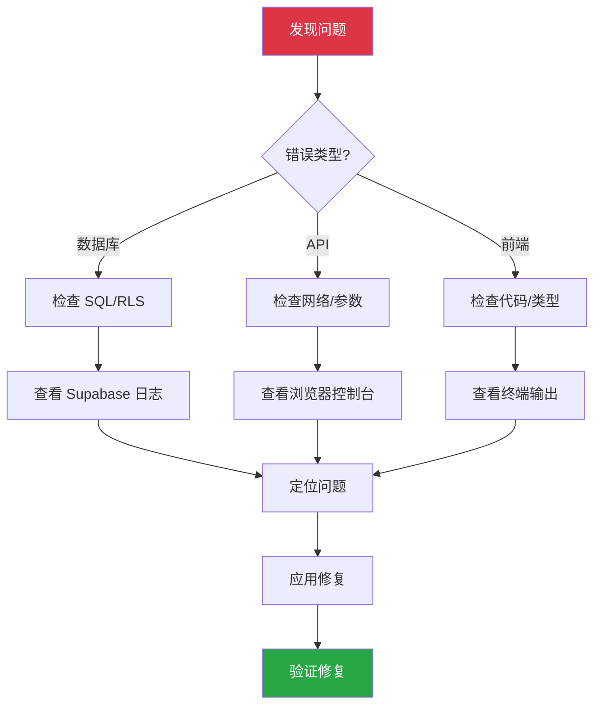

# 故障排除

> 常见问题、错误排查、解决方案

## 故障排查流程



## 1. 数据库问题

### 1.1 "relation does not exist"

**原因**: search_path 配置问题

**解决方案**:

```sql
-- 方法 1: 修改函数
ALTER FUNCTION my_function SET search_path = public;

-- 方法 2: 重建函数时添加
CREATE OR REPLACE FUNCTION my_function()
RETURNS ...
SECURITY DEFINER SET search_path = public
AS $$ ... $$ LANGUAGE plpgsql;
```

### 1.2 RPC 返回 null

**排查步骤**:

```sql
-- 1. 检查参数是否正确
SELECT my_function('正确的-uuid');

-- 2. 检查数据是否存在
SELECT * FROM target_table WHERE id = 'uuid';

-- 3. 检查 RLS 是否阻止
ALTER TABLE target_table DISABLE ROW LEVEL SECURITY;
-- 再次测试，如果成功则说明是 RLS 问题

-- 4. 检查函数逻辑
-- 添加 RAISE NOTICE 调试
RAISE NOTICE '参数值: %', p_param;
RAISE NOTICE '查询结果: %', v_result;
```

### 1.3 RLS 策略问题

**症状**: 查询返回空结果或权限错误

**排查**:

```sql
-- 临时禁用 RLS 测试
ALTER TABLE my_table DISABLE ROW LEVEL SECURITY;

-- 检查当前用户
SELECT auth.uid();

-- 检查策略
SELECT * FROM pg_policies WHERE tablename = 'my_table';

-- 添加调试策略
CREATE POLICY "Debug policy" ON my_table
  FOR ALL USING (true);  -- 仅用于调试！
```

## 2. API 问题

### 2.1 认证错误 (401)

**原因**: Token 过期或无效

**解决方案**:

```typescript
// 检查 session 状态
const { data: { session } } = await supabase.auth.getSession()
console.log('Session:', session)

// 手动刷新 token
const { data, error } = await supabase.auth.refreshSession()

// 重新登录
await supabase.auth.signOut()
await supabase.auth.signInWithPassword({ email, password })
```

### 2.2 请求超时

**原因**: 查询太慢或网络问题

**解决方案**:

```sql
-- 分析查询性能
EXPLAIN ANALYZE SELECT * FROM my_table WHERE ...;

-- 添加索引
CREATE INDEX idx_my_table_field ON my_table(field);

-- 优化 RPC 函数
-- 添加 LIMIT 限制返回数量
```

```typescript
// 设置请求超时
const supabase = createClient(url, key, {
  global: {
    fetch: (url, options) =>
      fetch(url, { ...options, signal: AbortSignal.timeout(10000) })
  }
})
```

### 2.3 类型不匹配

**症状**: TypeScript 类型错误

**解决方案**:

```typescript
// 方法 1: 重新生成类型
npx supabase gen types typescript --project-id xxx > src/types/database.ts

// 方法 2: 临时使用 unknown
const result = data as unknown as MyType

// 方法 3: 定义自定义类型
interface MyCustomType {
  id: string
  name: string
  // ...
}
const { data } = await supabase.from('table').select('*')
const typedData = data as MyCustomType[]
```

## 3. 前端问题

### 3.1 Hooks 规则错误

**症状**: "Rendered more hooks than during the previous render"

**解决方案**:

```typescript
// ❌ 错误: 条件调用 Hook
if (id) {
  const { data } = useQuery({ ... })
}

// ✅ 正确: 使用 enabled
const { data } = useQuery({
  queryKey: ['data', id],
  queryFn: () => getData(id),
  enabled: !!id,
})
```

### 3.2 无限重渲染

**原因**: Query key 或依赖项不稳定

**解决方案**:

```typescript
// ❌ 错误: 每次渲染创建新对象
const { data } = useQuery({
  queryKey: ['data', { filter }],  // 对象每次都是新的
  queryFn: () => getData(filter),
})

// ✅ 正确: 使用稳定的 key
const { data } = useQuery({
  queryKey: ['data', filter],  // 使用原始值
  queryFn: () => getData(filter),
})

// ✅ 正确: 使用 useMemo
const params = useMemo(() => ({ filter }), [filter])
const { data } = useQuery({
  queryKey: ['data', params],
  queryFn: () => getData(params),
})
```

### 3.3 环境变量未加载

**症状**: `import.meta.env.VITE_XXX` 为 undefined

**解决方案**:

```bash
# 1. 确认文件名正确
.env.local  # 本地开发

# 2. 确认变量名以 VITE_ 开头 (Vite 项目)
VITE_SUPABASE_URL=xxx

# 3. 重启开发服务器
npm run dev
```

## 4. 邮件问题

### 4.1 邮件发送失败

**排查清单**:

| 检查项 | 说明 |
|--------|------|
| DNS 记录 | SPF/DKIM 是否正确配置 |
| SMTP 配置 | 主机/端口/密码是否正确 |
| 发件人地址 | 是否使用已验证的域名 |
| API Key | Resend Key 是否有效 |

### 4.2 邮件进入垃圾箱

**解决方案**:

1. 检查 SPF/DKIM/DMARC 配置
2. 使用 [Mail Tester](https://www.mail-tester.com/) 测试
3. 避免垃圾邮件关键词
4. 等待域名预热

## 5. 调试工具

### 5.1 Supabase Dashboard

- **Logs**: Dashboard → Logs
- **SQL Editor**: 执行测试查询
- **Table Editor**: 查看数据

### 5.2 浏览器工具

```javascript
// 控制台查看 Supabase 状态
window.supabase = supabase  // 暴露到全局

// 查看当前用户
await supabase.auth.getUser()

// 查看 session
await supabase.auth.getSession()
```

### 5.3 React Query DevTools

```typescript
import { ReactQueryDevtools } from '@tanstack/react-query-devtools'

function App() {
  return (
    <QueryClientProvider client={queryClient}>
      {/* 你的应用 */}
      <ReactQueryDevtools initialIsOpen={false} />
    </QueryClientProvider>
  )
}
```

## 6. 常见错误代码

| 错误代码 | 含义 | 解决方案 |
|----------|------|----------|
| PGRST116 | 单行查询返回多行 | 添加 LIMIT 1 或使用 .single() |
| PGRST204 | 无内容 | 检查 RLS 策略或查询条件 |
| 42501 | 权限不足 | 检查 RLS 策略 |
| 23505 | 唯一约束冲突 | 检查重复数据 |
| 23503 | 外键约束失败 | 检查关联数据是否存在 |

## 7. 获取帮助

1. [Supabase 官方文档](https://supabase.com/docs)
2. [Supabase GitHub Issues](https://github.com/supabase/supabase/issues)
3. [Supabase Discord](https://discord.supabase.com)

---

> **返回**: [00-INDEX](./00-INDEX.md) - 文档导航
