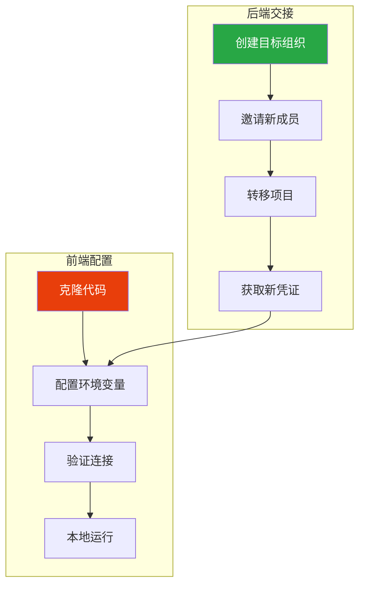
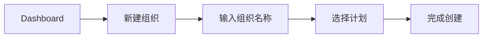
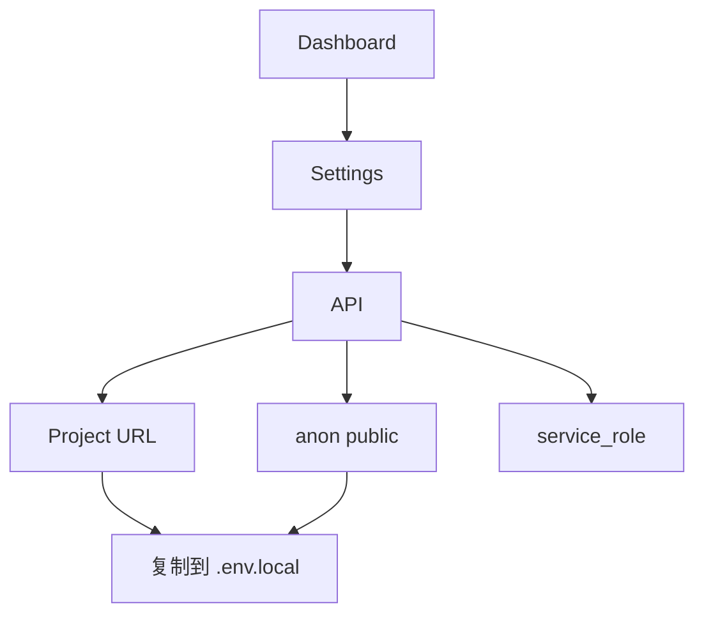
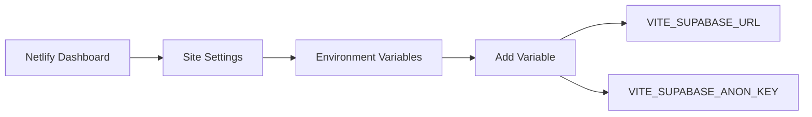

# 项目交接指南

> Supabase 项目转移 + 前端 SDK 配置完整流程

## 交接流程概览



---

## 1. Supabase 项目转移

### 1.1 前置条件

| 条件 | 要求 |
|------|------|
| 账号角色 | 必须是组织 **Owner** |
| 目标组织 | 需要提前创建或已有 |
| 项目状态 | 无正在进行的迁移任务 |

### 1.2 转移步骤

#### 步骤 1：创建或确认目标组织



1. 登录 [Supabase Dashboard](https://supabase.com/dashboard)
2. 点击左上角组织名称 → **New organization**
3. 填写组织名称，选择计划（Free/Pro/Team/Enterprise）

#### 步骤 2：邀请新成员（可选但推荐）

1. 进入目标组织 → **Settings** → **Team**
2. 点击 **Invite member**
3. 输入接收方邮箱
4. 选择角色：
   - **Owner** - 完全控制权限
   - **Administrator** - 管理权限（不能转移项目）
5. 发送邀请

#### 步骤 3：执行项目转移

1. 进入要转移的项目
2. 点击 **Settings** → **General**
3. 滚动到 **Transfer Project** 区域

```
┌─────────────────────────────────────────────────────────┐
│  Transfer Project                                        │
│  ─────────────────────────────────────────────────────  │
│  Transfer this project to a different organization.     │
│                                                          │
│  Target Organization: [选择目标组织 ▼]                   │
│                                                          │
│  ⚠️ This action cannot be undone.                       │
│                                                          │
│  [Transfer Project]                                      │
└─────────────────────────────────────────────────────────┘
```

4. 选择目标组织
5. 确认转移（⚠️ 此操作不可逆）

### 1.3 转移后变化

| 项目 | 变化 |
|------|------|
| Project URL | **不变** |
| API Keys | **不变** |
| 数据库内容 | **不变** |
| 组织归属 | 变更到新组织 |
| 计费主体 | 变更到新组织 |

### 1.4 需要交接的信息清单

```
📋 Supabase 项目交接清单
────────────────────────────────────────

✅ 必须交接
├── Project URL:        https://xxxxxxxx.supabase.co
├── Publishable Key:    sb_publishable_xxxxxxxxxxxxx
├── Service Role:       eyJhbGciOiJIUzI1NiIsInR5cCI6... (⚠️ 保密)
└── Dashboard 访问权限

📦 可选交接
├── 数据库连接串
├── JWT Secret
├── Storage 配置
└── Edge Functions
```

---

## 2. 前端 SDK 配置

### 2.1 获取 Supabase 凭证



1. 登录 Supabase Dashboard
2. 进入项目 → **Settings** (齿轮图标)
3. 点击 **API** 菜单
4. 获取以下信息：

| 凭证 | 位置 | 用途 |
|------|------|------|
| **Project URL** | Configuration → URL | API 端点 |
| **Publishable Key** | Project API keys → anon public | 前端公开使用 |
| **service_role key** | Project API keys → service_role secret | 服务端使用（⚠️ 保密） |

> **密钥格式**：新版本使用 `sb_publishable_xxxxx` 格式，旧 JWT 格式仍兼容

### 2.2 环境变量配置

#### 创建环境文件

```bash
# 在项目根目录执行
cp .env.local.example .env.local
```

#### 编辑 .env.local

```env
# ===========================================
# SRM 环境变量配置
# ===========================================

# Supabase 配置（从 Dashboard → Settings → API 获取）
VITE_SUPABASE_URL=https://xxxxxxxxxxxxx.supabase.co
VITE_SUPABASE_PUBLISHABLE_KEY=sb_publishable_xxxxxxxxxxxxx
```

> ⚠️ **安全提示**：
> - `Publishable Key` 可以公开，用于前端
> - `service_role key` **绝不能**放在前端代码或 `.env.local` 中
> - `.env.local` 已在 `.gitignore` 中，不会被提交
> - 旧格式 `VITE_SUPABASE_ANON_KEY` 仍然兼容

### 2.3 SDK 配置代码

#### Supabase 客户端初始化

```typescript
// src/lib/supabase.ts
import { createClient } from '@supabase/supabase-js'
import type { Database } from '../types/database'

// 从环境变量读取配置
const supabaseUrl = import.meta.env.VITE_SUPABASE_URL
const supabaseKey = import.meta.env.VITE_SUPABASE_PUBLISHABLE_KEY

// 验证配置存在
if (!supabaseUrl || !supabaseKey) {
  throw new Error(
    '缺少 Supabase 配置！\n' +
    '请确保 .env.local 文件存在并包含：\n' +
    '  VITE_SUPABASE_URL=xxx\n' +
    '  VITE_SUPABASE_PUBLISHABLE_KEY=xxx'
  )
}

// 创建客户端实例
export const supabase = createClient<Database>(supabaseUrl, supabaseKey, {
  auth: {
    persistSession: true,      // 持久化会话
    autoRefreshToken: true,    // 自动刷新 Token
    detectSessionInUrl: true,  // 检测 URL 中的会话
    flowType: 'pkce',          // 使用 PKCE 流程（更安全）
  },
})
```

### 2.4 验证连接

#### 方法一：控制台测试

```typescript
// 在浏览器控制台或组件中执行
import { supabase } from './lib/supabase'

// 测试连接 - 获取当前用户
const { data, error } = await supabase.auth.getUser()
console.log('用户:', data.user)
console.log('错误:', error)

// 测试数据库连接
const { data: suppliers, error: dbError } = await supabase
  .from('suppliers')
  .select('id, name')
  .limit(1)

console.log('供应商:', suppliers)
console.log('数据库错误:', dbError)
```

#### 方法二：启动项目验证

```bash
# 安装依赖
npm install

# 启动开发服务器
npm run dev
```

访问 http://localhost:5173，检查：
- [ ] 页面正常加载
- [ ] 登录功能正常
- [ ] 数据能正常显示

### 2.5 常见连接问题

#### 问题 1：环境变量未生效

```bash
# 错误信息
❌ 缺少 Supabase 配置，请设置 VITE_SUPABASE_URL 和 VITE_SUPABASE_ANON_KEY 环境变量
```

**解决方案**：
1. 确认 `.env.local` 文件在项目根目录
2. 确认环境变量名称正确（必须以 `VITE_` 开头）
3. 重启开发服务器（`npm run dev`）

#### 问题 2：CORS 错误

```bash
# 错误信息
❌ Access to XMLHttpRequest at 'https://xxx.supabase.co' from origin 'http://localhost:5173' has been blocked by CORS policy
```

**解决方案**：
在 Supabase Dashboard → Settings → API → 添加允许的域名：
```
http://localhost:5173
http://localhost:5174
```

#### 问题 3：认证失败

```bash
# 错误信息
❌ Invalid API key
```

**解决方案**：
1. 确认使用的是 `anon key`，不是 `service_role key`
2. 确认 key 复制完整（通常很长）
3. 重新从 Dashboard 复制 key

---

## 3. 部署环境配置

### 3.1 Netlify 配置



**操作步骤**：
1. Netlify Dashboard → Site Settings
2. Build & Deploy → Environment Variables
3. 添加变量：

| Key | Value |
|-----|-------|
| `VITE_SUPABASE_URL` | `https://xxx.supabase.co` |
| `VITE_SUPABASE_ANON_KEY` | `eyJhbGciOiJIUzI1...` |

### 3.2 Vercel 配置

1. Vercel Dashboard → 项目 → Settings
2. Environment Variables
3. 添加相同的变量

### 3.3 GitHub Actions（CI/CD）

在仓库 Settings → Secrets and variables → Actions 中添加：

```yaml
# .github/workflows/deploy.yml
env:
  VITE_SUPABASE_URL: ${{ secrets.VITE_SUPABASE_URL }}
  VITE_SUPABASE_ANON_KEY: ${{ secrets.VITE_SUPABASE_ANON_KEY }}
```

---

## 4. 完整交接检查清单

```markdown
## 项目交接检查清单

### 后端交接
- [ ] 创建目标 Supabase 组织
- [ ] 邀请新成员并分配角色
- [ ] 执行项目转移
- [ ] 确认转移成功

### 凭证交接
- [ ] Project URL
- [ ] anon key
- [ ] Dashboard 访问权限
- [ ] （可选）service_role key

### 前端配置
- [ ] 克隆/接收代码
- [ ] 创建 .env.local 文件
- [ ] 填写 Supabase 凭证
- [ ] 运行 `npm install`
- [ ] 运行 `npm run dev`
- [ ] 验证功能正常

### 部署配置（如适用）
- [ ] Netlify/Vercel 环境变量
- [ ] 域名 DNS 配置
- [ ] 构建验证

### 其他服务（如适用）
- [ ] Resend API Key（邮件服务）
- [ ] Cloudflare DNS 配置
- [ ] GitHub 仓库权限
```

---

## 常见问题

### Q: 项目转移后，原来的 API Key 还有用吗？

**A**: 有用。项目转移只改变组织归属，不改变项目基础设施，所有 URL 和 Key 保持不变。

### Q: 可以把项目转移给个人账号吗？

**A**: 可以。目标可以是任何你有 Owner 权限的组织，包括个人默认组织。

### Q: 转移后计费怎么处理？

**A**: 转移后，项目消耗的资源将计入目标组织的账单。

### Q: 前端代码中的 anon key 安全吗？

**A**: 安全。anon key 设计为可以公开，RLS (Row Level Security) 策略会保护数据安全。但 service_role key 绝不能暴露在前端。

---

> **相关文档**:
> - [02-SUPABASE-SETUP](./02-SUPABASE-SETUP.md) - Supabase 基础配置
> - [06-AUTH-EMAIL](./06-AUTH-EMAIL.md) - 认证与邮件配置
> - [08-TROUBLESHOOTING](./08-TROUBLESHOOTING.md) - 故障排除
