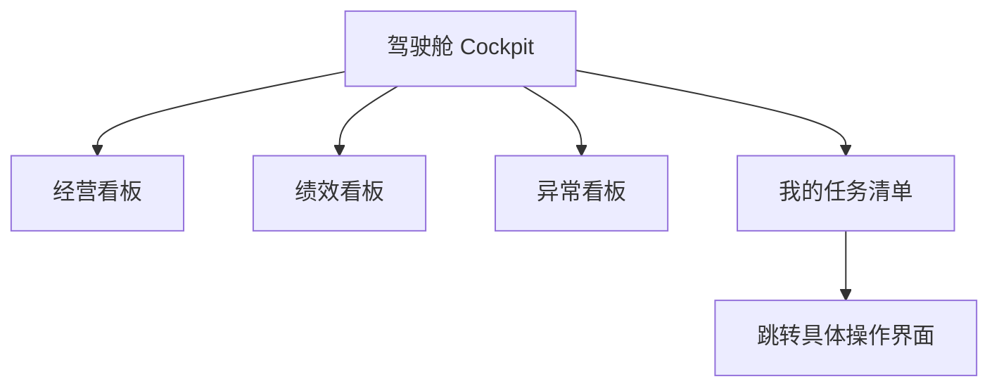

# 

## 1. 系统核心设计理念

会议主要讨论了供应商管理系统（及产品运营系统）的架构设计，强调以**流程驱动**和**用户任务**为核心。

*   **流程引擎 (Process Engine)**: 系统需适应公司的组织流程，通过流程引擎配置差异。
*   **任务驱动 (Task Driven)**: 用户进入系统后，由流程引擎推送到【驾驶舱】的“任务清单”，可点击跳转到具体操作界面。
*   **角色视角**: 不同用户（如一线操作 v.s.管理层）看到的系统界面和数据应基于其职能定制。

## 2. "驾驶舱" (Cockpit) 设计

“驾驶舱”不仅是仪表盘，而是用户的**统一工作入口**和**导航仪**。
包含以下四大板块：

1.  **经营看板 **: 展示全局事宜、公司级关键指标。
2.  **绩效看板 **:
    *   基于用户背后的职能身份（千人千面）。
    *   展示与个人/岗位KPI强相关的结果数据。
    *   用于指导个人工作调整。
3.  **异常看板**:
    *   我们的业务特色，使得异常看板成为刚需
    *   看板作为集合，指向具体需要解决的问题。
4.  **我的任务清单**:
    *   由流程引擎推送到当前节点的具体任务。
    *   是用户执行操作的主要入口（跳转）。

  
## 菜单栏如何设计  
  
### 讨论两种分模块方式  
- 功能分区  
- 流程分区（自上而下不同生命周期环节）  
        - 子菜单即更微观的步骤  
  
### 是否按类型分类  
  
（如 OMS中，不同订单导致不同界面；那么SRM中，是否不同供应商不同界面？）  
  
 > **思维方式：取决于不同类型是否带来不同流程。**  
   
   
### 菜单+子菜单设计 导致的操作“深度”如何应对  
  
可以在“驾驶舱”- 【我的任务】位置，自动跳转到相应的操作界面  
界面设计，本身反映的就是[工作内容]  
  
从而**实现**  
> **看板 → 决策 → 操作**